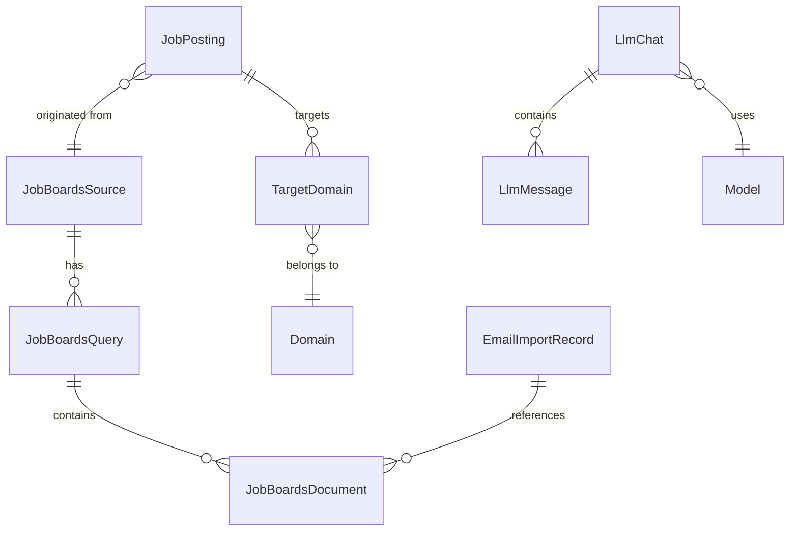

# WWWorkRemote: The Autonomous Remote Job Synthesis Engine

> "Because searching for remote work shouldn't be a second full-time job."

---

## 📖 The Story of WWWorkRemote

### The Genesis (Early 2024)
WWWorkRemote was born out of frustration. In the post-2023 remote work landscape, job seekers were drowning in noise. LinkedIn was flooded with ghost postings, Indeed was cluttered with stale data, and niche boards like HackerNews and WWR required manual monitoring. 

The original vision was simple: **Aggregated Clarity**. It started as a few Ruby scripts to fetch job stories from the HackerNews API and store them in a local SQLite database.

### The Evolution (2025)
As the project grew, so did the complexity of the remote job market. Simple scraping wasn't enough; we needed **Synthesis**. 
- **The Vector Pivot**: We integrated `pgvector` to allow for semantic search—finding jobs based on *what they are*, not just the keywords they used.
- **The LLM Revolution**: Instead of manual tagging, we introduced a local-first LLM pipeline (the "Captain Caveman" architecture) to categorize jobs, extract technical tags, and identify "real" remote opportunities from "remote-optional" noise.

### The Modern Era (April 2026)
Today, WWWorkRemote is a high-performance, autonomous engine built on **Rails 8** and **Ruby 4.0**. It doesn't just fetch; it *understands*.
- It scans your **Apple Mail exports (.eml)** for job alerts.
- It protects your LLM context with a robust **Guardrails Pipeline**.
- It runs concurrently using **Falcon** and **Fibers**, processing thousands of job postings per minute while you sleep.

---

## 🏗️ System Architecture

### 1. Ingestion Pipeline
We utilize a multi-source ingestion strategy:
- **API Fetchers**: Direct integrations with Adzuna, LinkedIn, Indeed, Remotive, and HackerNews.
- **Email Ingestion**: A unique local adapter that scans `~/.wwworkremote/` for `.eml` files, extracting canonical links from tracker-heavy emails.

### 2. The "Captain Caveman" LLM Strategy
We follow a strict "Local First, Frontier Fallback" rule:
- **Local**: `llama.cpp` (Qwen 2.5 Coder) handles high-volume tasks like categorization and sanitization.
- **Frontier**: Claude 3.5 Sonnet fills the gaps for complex reasoning or multi-document synthesis.
- **Guardrails**: All untrusted text (job descriptions) passes through a `Normalize -> Heuristic Scan -> Risk Classification` pipeline before reaching the LLM.

### 3. High-Performance Concurrency
Built on **Falcon**, our server operates in a single-process, fiber-based threaded mode. This allows for:
- Non-blocking I/O during long LLM calls.
- Thousands of concurrent jobs via **Async Job**.
- Minimal infrastructure footprint.

---

## 🛠️ Tech Stack

- **Framework**: Rails 8.0.x
- **Runtime**: Ruby 4.0.2 (Optimized for Fibers)
- **App Server**: Falcon (Fiber-based)
- **Database**: PostgreSQL + `pgvector` + `pg_trgm`
- **LLM Engine**: RubyLLM + llama.cpp + Claude 3.5
- **UI**: Dracula Pro + Tailwind CSS + DaisyUI
- **Observability**: OpenTelemetry + PgHero + Mission Control Jobs

---

## 🗺️ Entity Relationship Diagram



---

## 🚀 Getting Started

### Prerequisites
- PostgreSQL 16+
- llama.cpp server running on `localhost:8080`
- Redis (for ActionCable/Solid Queue)

### Setup
```bash
bin/setup
bin/rails ruby_llm:load_models

# Configure MaxMind for local geolocation
export MAXMIND_ACCOUNT_ID="your_id"
export MAXMIND_LICENSE_KEY="your_key"
bin/update-geoip

bundle exec rake eml:scan
```

### Development
```bash
bin/dev
```
Access the dashboard at `http://localhost:3010`.

---

## ⚖️ License
WWWorkRemote is proprietary software. All rights reserved.
