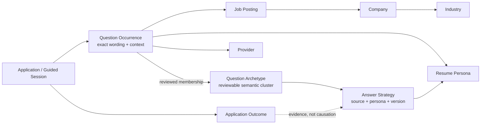
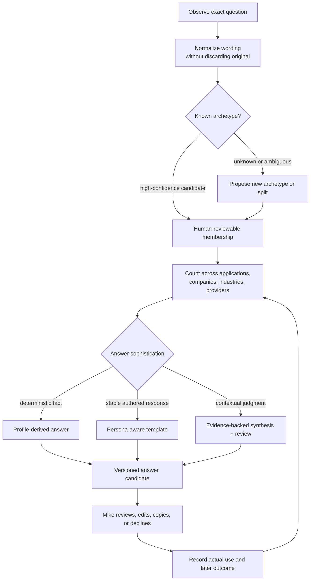

# Application Question Knowledge Graph

## Purpose

Application research should accumulate more than a list of fields. Each
observed question is evidence about an application, while repeated evidence
reveals question archetypes, reusable answer strategies, provider conventions,
and differences among companies and industries. The graph must preserve both:
the exact occurrence and the learned pattern.

The existing model has three useful but disconnected seams:

- `ApplicationFieldObservation` is the per-application observation, including
  normalized prompt, question kind, page step, persona, and trace.
- `ApplicationQuestion` stores a question and answer associated with a posting.
- `ApplicationAnswerTemplate` stores reusable answers by normalized prompt and
  persona.

TASK-113 connects those seams without redefining any one of them as the whole
truth.

## Concept graph

The graph edge from outcome to answer strategy is deliberately evidentiary.
An interview or rejection can correlate with an answer, but this system must
not claim the answer caused the outcome without stronger evidence.

## Occurrence-to-answer loop

## Invariants

1. An occurrence is never overwritten by an archetype assignment.
2. Raw wording and normalized wording coexist.
3. Archetype membership has provenance and confidence and can be corrected.
4. Answer strategies are versioned and persona-aware.
5. “Most common” and “best answer” are separate questions.
6. Submitted answers outrank proposed answers as evidence of what happened, but
   do not silently become universal templates.
7. Outcomes enrich analysis but do not establish causal claims by themselves.
8. Recommendations never cross the commitment boundary or submit applications.

## Views this enables

- Most common archetypes overall and by company, industry, provider, or role.
- Wording variants inside one archetype.
- Deterministic versus authored versus sophisticated-answer demand.
- Coverage: archetypes with no approved answer strategy.
- Persona fit: where the same archetype needs meaningfully different answers.
- Drift: new archetypes or wording variants appearing in a provider flow.
- Outcome overlays with explicit sample sizes and non-causal language.

## Automation readiness

*(wayfinder map doc-7 / [ADR 010](../adr/010-link-to-application-capture-and-the-datalake.md);
shape from
[Automation-readiness corpus and eval-harness shape](../../backlog/tasks/task-124%20-%20Wayfinder-decision-automation-readiness-corpus-and-eval-harness-shape.md).
**Built TASK-127, 2026-08-30.**)*

The **Question Archetype is the unit of automation readiness.** "Adapt the system toward
automating these applications" means building a decision corpus and an eval loop — not a
training run.

- **`archetype_readiness_assessments`** — append-only, FindingDisposition-style. One
  archetype's readiness class is `deterministic` / `generatable` / `needs-human`, assigned
  by Mike during archetype review with an evidence-based **suggested default** (inputs:
  occurrence frequency, historically-winning strategy source, median edit distance,
  sample-size floor). Latest applicable assessment wins for presentation; a merge or split
  carries the prior assessment forward as a *suggestion*, never silently.
- **`answer_proposal_verdicts`** — **value-free**. sha256 hashes + `edit_distance` +
  `strategy_source` (`canned` / `template` / `ai`) + `verdict`
  (`accepted` / `edited` / `declined`). One row per proposal shown in the sidepanel
  answer flow (TASK-78), declines included. No answer text.
- **Verdict capture:** `LLM::AnswerGenerator#apply_answer` writes a `declined` row the
  moment a proposal is shown; `Api::V0::ApplicationStatusesController#capture_answers`
  flips it to `accepted` / `edited` with a real Levenshtein distance when the submitted
  answers arrive; the sidepanel template-fill path posts to
  `POST /api/v0/answer_proposal_verdicts` (`AnswerProposalVerdicts::Record`), which hashes
  the text server-side and keeps only the numbers.
- **The eval harness** (`AutomationReadiness::Eval`, `rake automation_readiness:eval`)
  reports verbatim-acceptance rate + median edit distance split by `strategy_source` per
  archetype over the sample floor, and replays `LLM::AnswerGenerator.call` against a
  representative occurrence **in a rolled-back transaction** — advisory report to
  `data/datalake/corpus/eval_report.json`, no DB write, no answer filled or submitted.
  `AutomationReadiness::CorpusExporter` (`rake automation_readiness:corpus`) writes the
  per-archetype JSONL. `QuestionArchetypes::SuggestedReadiness` computes the default Mike
  starts from on the archetype review page.
- **Advisory only, hard guardrail** (invariant 8 extended): nothing the readiness loop
  produces flips an archetype to auto-fill or auto-submit. It only ever changes whether a
  proposal is offered *without* a review prompt — never whether an answer is entered or
  sent.

## Delivery boundary

The first implementation should use the relational database as the source of
truth and project a graph-shaped read model for visualization. A dedicated
graph database is not justified until real traversal or scale evidence shows
the relational joins and aggregates are insufficient.

## Built (TASK-113, 2026-08-30)

The first implementation, per the delivery boundary above — relational tables +
a computed read model, deterministic exact-normalized-prompt clustering, human
merge/split.

| Piece | What |
|---|---|
| `QuestionOccurrence` | Immutable per-application evidence. `raw_prompt` + full provenance (job posting, application, guided session, provider, persona, page step; industry via the posting's AI category, outcome via the application). An `on: :update` guard rejects any change to the wording/provenance columns — only the archetype pointer is mutable. |
| `QuestionArchetype` | Reviewable cluster. `merged_into` self-reference is the merge tombstone; `active` / `merged` scopes. `wording_variants`, `recommended_handling`. |
| `AnswerStrategy` | `question_archetype` + nullable `persona_id`, `source` (`deterministic`/`authored`/`learned`/`submitted`/`ai`), `sophistication` (`deterministic`/`authored`/`synthesized`), `version`, `confidence`, `enabled`, `provenance` jsonb. Advisory — never auto-filled. |
| `QuestionOccurrences::Record` | Ingest: an `ApplicationFieldObservation` or a manual `ApplicationQuestion` → a deduped occurrence + exact-prompt archetype assignment (`archetype_assigned_by: "auto:exact_prompt"`, confidence 100). Wired non-blocking into the observations API and `ApplicationQuestion` create. |
| `QuestionGraph::Backfill` / `rake question_graph:backfill` | Re-runnable backfill of existing observations + questions, plus answer-strategy seeding from `ApplicationAnswerTemplate` and submitted `ApplicationQuestion` answers. |
| `QuestionArchetypes::Merge` / `::Split` | Explicit human corrections. Merge repoints occurrences + deduped strategies and tombstones the source; split moves a strict subset to a fresh archetype. Wording is never touched. TASK-127 hooks Merge for readiness carry-forward. |
| `QuestionGraph::Overview` + `QuestionArchetypes::Recommendation` | The `/question_archetypes` review surface: ranked archetypes with company/provider spread, coverage gaps, per-archetype occurrences/variants/strategies, and an advisory handling recommendation. Read-only apart from merge/split. |

**Deferred:** DOM-derived occurrence extraction through `Datalake::Bundle` (the value-free
`ApplicationFieldObservation` stream is the primary input today — wayfinder doc-7 comment #2);
richer NLP/embedding clustering beyond exact normalized-prompt match; the readiness-assessment
and verdict tables (TASK-127).
