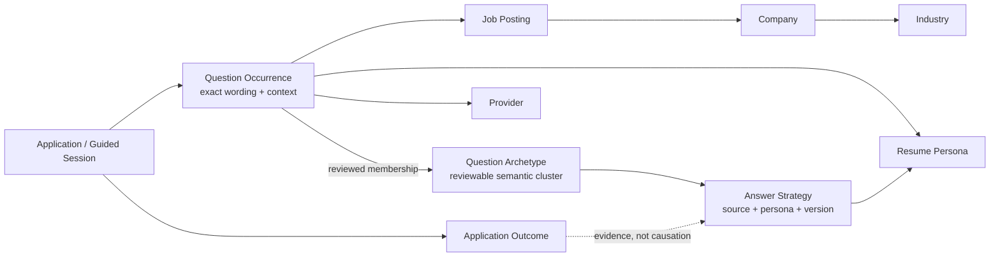
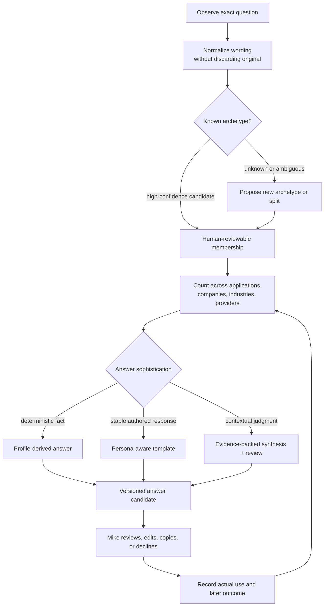

# Application Question Knowledge Graph

## Purpose

Application research should accumulate more than a list of fields. Each
observed question is evidence about an application, while repeated evidence
reveals question archetypes, reusable answer strategies, provider conventions,
and differences among companies and industries. The graph must preserve both:
the exact occurrence and the learned pattern.

The existing model has three useful but disconnected seams:

- `ApplicationFieldObservation` is the per-application observation, including
  normalized prompt, question kind, page step, persona, and trace.
- `ApplicationQuestion` stores a question and answer associated with a posting.
- `ApplicationAnswerTemplate` stores reusable answers by normalized prompt and
  persona.

TASK-113 connects those seams without redefining any one of them as the whole
truth.

## Concept graph

The graph edge from outcome to answer strategy is deliberately evidentiary.
An interview or rejection can correlate with an answer, but this system must
not claim the answer caused the outcome without stronger evidence.

## Occurrence-to-answer loop

## Invariants

1. An occurrence is never overwritten by an archetype assignment.
2. Raw wording and normalized wording coexist.
3. Archetype membership has provenance and confidence and can be corrected.
4. Answer strategies are versioned and persona-aware.
5. “Most common” and “best answer” are separate questions.
6. Submitted answers outrank proposed answers as evidence of what happened, but
   do not silently become universal templates.
7. Outcomes enrich analysis but do not establish causal claims by themselves.
8. Recommendations never cross the commitment boundary or submit applications.

## Views this enables

- Most common archetypes overall and by company, industry, provider, or role.
- Wording variants inside one archetype.
- Deterministic versus authored versus sophisticated-answer demand.
- Coverage: archetypes with no approved answer strategy.
- Persona fit: where the same archetype needs meaningfully different answers.
- Drift: new archetypes or wording variants appearing in a provider flow.
- Outcome overlays with explicit sample sizes and non-causal language.

## Delivery boundary

The first implementation should use the relational database as the source of
truth and project a graph-shaped read model for visualization. A dedicated
graph database is not justified until real traversal or scale evidence shows
the relational joins and aggregates are insufficient.
