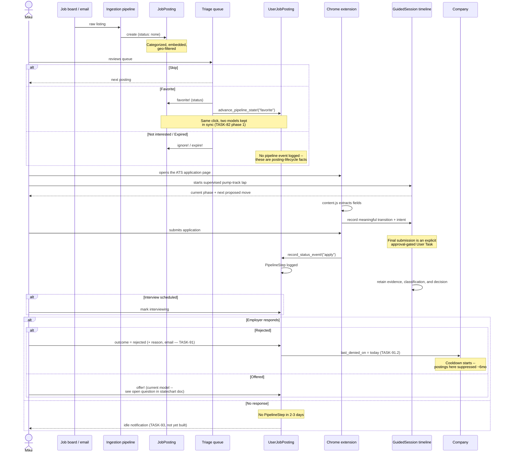

# One Posting's Journey Through the Pipeline

A single sequence, start to finish: a posting is discovered, Mike triages it, applies through the
extension, and eventually hears back. Not every posting reaches every step — most stop at triage.

## Reading this against the real code

- Triage's Favorite/Not interested/Expired all post to `Admin::PipelineStepsController`
  (`app/controllers/admin/pipeline_steps_controller.rb`) — one controller, one endpoint, dispatching
  on `params[:status]`.
- The extension's apply event lands via `Api::V0::ApplicationStatusesController`, which calls
  `UserJobPosting#record_status_event!` directly — the extension never touches `JobPosting.status`.
- The idle-notification and company-cooldown steps are drawn here because they're the *intended*
  next links in this chain, not because they exist yet — see TASK-93 and TASK-91.2.
