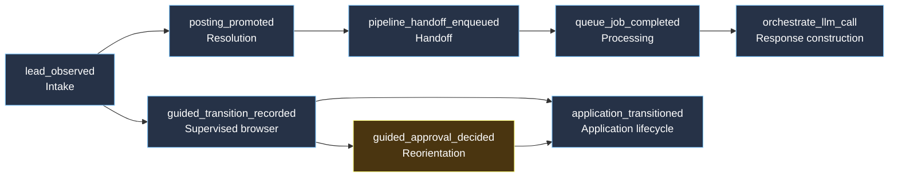

# Business-Process Signals

“Up” is an infrastructure fact. A functional WWWorkRemote is a sequence of
business facts moving through the job-posting-to-application pump track.

## Truth seams

| Stage | Truth seam | Signal | What it proves |
| --- | --- | --- | --- |
| Intake | `Api::LeadsController#create` | `lead_observed` | A real posting was seen and accepted |
| Resolution | `Leads::CaptureService#perform` | `posting_promoted` | A captured lead became a durable posting |
| Handoff | `Leads::CaptureService#enqueue_pipeline` | `pipeline_handoff_enqueued` | Analysis, matching, and strategy work was handed off |
| Processing | `SolidQueueOtel` | `queue_job_completed` | A background step actually finished, with an outcome |
| Synthesis | `LLM::Orchestrator#call` | existing `orchestrate_llm_call` span | The intelligence step was attempted; outcome remains on the existing LLM span |
| Guided flow | `Api::GuidedSessionEventsController#create` | `guided_transition_recorded` | A supervised browser transition was durably recorded |
| Approval | `GuidedSessionsController#approval` | `guided_approval_decided` | A human made the decision at a consequential boundary |
| Application | `Api::V0::ApplicationStatusesController#create` | `application_transitioned` | The user's application lifecycle changed |

Signals carry only bounded dimensions: `process`, `stage`, `outcome`,
`provider`, `phase`, and `job_class`. They never carry posting text, answers,
URLs, credentials, or tokens. Signal emission is observational and must never
be able to fail the operation being observed.

## Signal graph



## Composite interpretations

| Signal set | Simple meaning | Interpretation |
| --- | --- | --- |
| `lead_observed` → `posting_promoted` | **Intake works** | The system can turn a noticed opportunity into a durable posting |
| `posting_promoted` → `pipeline_handoff_enqueued` → `queue_job_completed` | **Processing works** | The posting crossed the asynchronous handoff and work really ran |
| `queue_job_completed` + successful `orchestrate_llm_call` span | **Intelligence works** | The system produced a downstream result, not just a queued job |
| `guided_transition_recorded` → `guided_approval_decided` | **Supervision works** | The observed browser flow reached a human decision point |
| `guided_transition_recorded` without a later approval decision | **Held** | The lap is waiting at ambiguity or consequence; this is not automatically an error |
| `application_transitioned` after approval | **Application works** | The authorized human decision reached the application lifecycle |
| queue success with no downstream business signal | **Technically up, functionally stalled** | Worker execution is healthy but the business handoff is broken or incomplete |
| repeated error outcomes at one seam | **Degraded** | The process is operating with a localized failure mode |

## Process assertion

For a time window `W`, define a completed functional lap as:

```text
functional_lap(W) =
  lead_observed
  ∧ posting_promoted
  ∧ pipeline_handoff_enqueued
  ∧ queue_job_completed(success)
  ∧ orchestrate_llm_call(success)
```

The supervised application branch is intentionally separate:

```text
supervised_application(W) =
  guided_transition_recorded
  ∧ (guided_approval_decided OR held_at_human_task)
  ∧ application_transitioned only_after approval
```

These are trace-level assertions, not a single health percentage. Counts and
latencies can be aggregated later, but the graph preserves the more important
question: which handoff stopped producing the next business fact?

## Operational use

Start with the graph when investigating a report that “the system is running.”
Find the last signal present and the first signal absent. That missing edge is
the smallest useful search area: capture, promotion, enqueue, worker execution,
LLM synthesis, human approval, or application transition.
