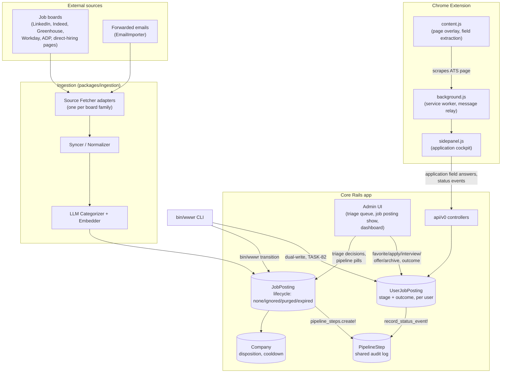

# System Components and How They Collaborate

The high-level shape: external job sources feed an ingestion pipeline that produces `JobPosting`
records; Mike works those postings through the Rails app and the Chrome extension; every action
on either side lands in the same `PipelineStep` audit trail.

## What each piece owns

| Component | Owns | Does not own |
|---|---|---|
| `JobPosting` | Whether the listing itself is alive (`none`/`ignored`/`purged`/`expired`) | Whether Mike is pursuing it |
| `Company` | Reputation signals, ingestion toggles, decline cooldown (TASK-91) | Any single posting's state |
| `UserJobPosting` | Mike's pipeline stage and the employer's outcome for one posting | The posting's own lifecycle |
| `PipelineStep` | The append-only audit trail — every status change and note, from any writer | Current state (it's a log, not a projection) |
| Chrome extension | Reading the ATS page Mike is actually looking at, and writing that context back | Anything about postings Mike hasn't opened |
| `bin/wwwr` | A terminal-native path to the same actions the UI takes | A separate data model — see the pipeline statechart doc |

See `pipeline-statechart.md` for how `JobPosting`, `UserJobPosting`, and outcome actually transition,
and `application-sequence.md` for the same system shown as a single request's journey through it.
