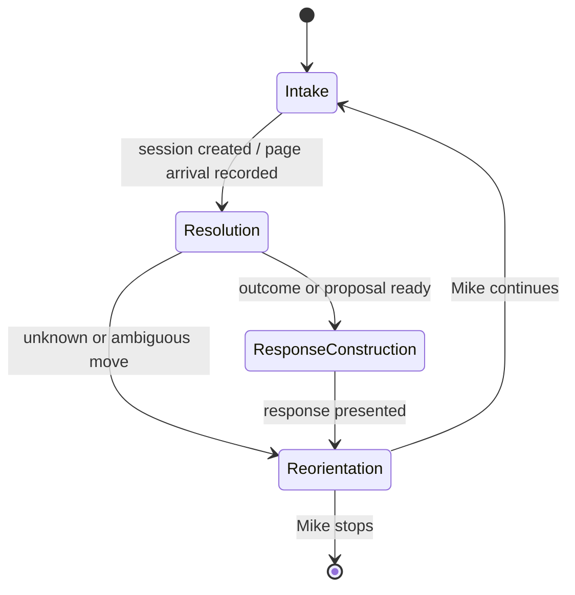

# Guided Session Flow: BPMN-lite Validation Scheme

This diagram is the executable design sketch for a supervised application lap.
It borrows BPMN vocabulary without introducing Camunda, Temporal, or a native
AASM/BPMN integration. The durable implementation is the `GuidedSession` plus
its `GuidedSessionEvent` timeline; this flow is the validation scheme those
modules must satisfy.

## Flow

```mermaid
flowchart LR
    subgraph Intake["Intake · drop-in"]
        I0((Start lap))
        I1["User Task<br/>Paste posting URL<br/>declare session purpose"]
        I2[["Service Task<br/>Create GuidedSession<br/>phase: intake"]]
        I3(("Intermediate Event<br/>Record page arrival"))
    end

    subgraph Resolution["Resolution · bottom"]
        R1[["Service Task<br/>Observe posting/application<br/>capture value-free structure"]]
        R2["Service Task<br/>Propose next move"]
        R3{"Gateway<br/>Known and reversible?"}
    end

    subgraph Response["Response Construction · climb"]
        C1[["Service Task<br/>Construct evidence + response"]]
        C2["User Task<br/>Review proposal and intent"]
    end

    subgraph Reorientation["Reorientation · berm"]
        O1{"Gateway<br/>Approval required?"}
        O2["User Task<br/>Approve / edit / deny"]
        O3[["Service Task<br/>Record decision + outcome"]]
        O4{"Gateway<br/>Continue or stop?"}
        O5((Stop lap))
    end

    I0 --> I1 --> I2 --> I3 --> R1 --> R2 --> R3
    R3 -->|yes| C1
    R3 -->|no / ambiguous| O2
    C1 --> C2 --> O1
    O1 -->|no| O3
    O1 -->|yes| O2
    O2 -->|approve / edit| O3
    O2 -->|deny / interrupt| O3
    O3 --> O4
    O4 -->|continue: next lap| I1
    O4 -->|stop| O5

    classDef user fill:#25194d,stroke:#9580ff,color:#fff
    classDef service fill:#123b3b,stroke:#8aff80,color:#fff
    classDef gateway fill:#4a3510,stroke:#ffff80,color:#fff
    classDef event fill:#263247,stroke:#80c8ff,color:#fff
    class I1,C2,O2 user
    class I2,R1,R2,C1,O3 service
    class R3,O1,O4 gateway
    class I0,I3,O5 event
```

## Validation rules

| BPMN-lite element | Domain contract | Current implementation seam |
| --- | --- | --- |
| User Task | Mike supplies intent or authorizes a consequential move | Guided-session UI; pending application submission controls |
| Service Task | System proposes or records; it does not authorize itself | `GuidedSessionEvent` API and extension adapter |
| Gateway | Classification determines whether work can proceed | `requirement`, `reversibility`, `approval_state` |
| Intermediate Event | A meaningful transition is durable and reviewable | `GuidedSessionEvent`; application-form arrival and paused submission are captured by the local extension |
| Loop | Reorientation may begin another lap or stop | `GuidedSession` status and durable `playback_position` |

The safety invariant is simple: an unknown, ambiguous, or irreversible move
must take the `User Task` path. The guided extension pauses the application
form's final submit boundary and records a pending event; final application
submission is always an approval-required move, even when the preceding run
was deterministic. Approval currently records the human decision only; a
separate execution slice must define how an approved provider action resumes.

Application research and application execution share this flow. Research may
open and inspect provider steps, producing a reusable map of pages, questions,
and transitions, but it stops at a commitment boundary. A declared purpose is
context for classification, not permission to transmit data or submit.

The tracked source URL carries the local guided-session correlation token. On
an application page, the extension records a bounded, value-free structure:
field key, label, control type, required state, and broad classification. It
does not record entered values. Reopening the same page creates another
observation so repeatability and provider drift can be compared explicitly.

## State overlay

This state overlay is deliberately smaller than the event vocabulary. A phase
describes where the lap is; events explain what happened, why, and under what
safety classification. Playback position is a resumable viewing cursor, not a
claim that the underlying application action has been authorized.

## Comparison against the Reference Scenario

When a session reaches `completed` (or on an explicit review-page action) it
materializes into an ordinary `Scenario` and is compared against its provider's
[Reference Scenario](signature-registry.md#reference-scenario--the-golden-master-not-a-platonic-ideal).
The comparison model — coverage versus drift, the `ReferenceComparison` /
`ComparisonFinding` / `FindingDisposition` layers, and the rule that comparison
is advisory and never authorizes or advances an application — is
[ADR 009](../adr/009-reference-comparison-drift-and-coverage.md). A research
session stopping at the first commitment boundary is *incomplete coverage by
design*, distinct from drift, and the first commitment boundary itself stays a
visible, applicable checkpoint.
