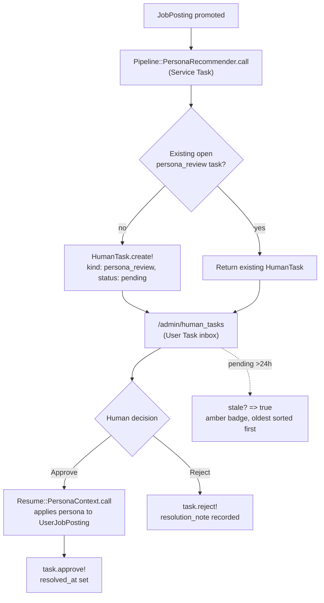
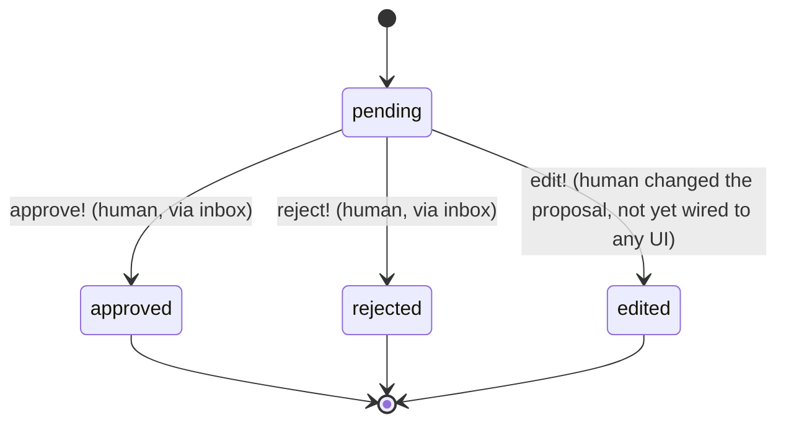

# The Human Task Pipeline: BPMN-lite Automation with a Human Gate

Built 2026-08-27 (**TASK-97**) after a live end-to-end pipeline test (capture → promote → analyze →
pick a persona → build a resume → fill an ATS form → submit) surfaced that every judgment point in
that chain only ever happened as a live conversation with Claude — nothing recorded that a human
review was required, requested, or given.

Camunda/Temporal were both researched as prior art and rejected: Statesman would just duplicate the
transition-history job `PipelineStep` already does, and Temporal's Ruby SDK means running a separate
server for a single-user app. What's here instead borrows only BPMN's *vocabulary* — Service Task,
User Task — applied with the state-machine tools this app already uses (AASM, a plain ActiveRecord
table), not a workflow engine.

## Roles

- **Service Task** — an automated evaluator (`Pipeline::PersonaRecommender`) that reads a
  `JobPosting` and *proposes* a decision. It never acts on its own judgment.
- **User Task** — a `HumanTask` row: the proposal, sitting untouched until a person resolves it.
  Several can be open on one posting at once (three unanswered application questions, a persona
  pick, a resume review), which is why this is its own table rather than an AASM state bolted onto
  `UserJobPosting` — a single state column can't represent "three things pending in parallel."
- **Timer Intermediate Event** (BPMN's escalation timeout, see the Travel Booking example in OMG's
  *BPMN 2.0 by Example*) — approximated here as `HumanTask#stale?` (pending >24h). AASM has no
  timer/escalation primitive of its own; this is a plain attribute check, not a state, and there's
  no notification channel wired up to actually page anyone yet — it only drives a visual warning
  badge in the inbox.

## Flow

## State machine (`HumanTask.status`, AASM)

`pending` has no auto-advancing transition out — that's the actual "awaiting human" gate TASK-97
asked for. Nothing times it out or approves it automatically; `stale?` only changes how it's
*displayed*, never its state.

## What exists vs. what's deferred

| Piece | Status |
|---|---|
| `HumanTask` model + migration | Built |
| `Pipeline::PersonaRecommender` (persona_review Service Task) | Built, LLM-backed, live-tested |
| `Admin::HumanTasksController` + inbox view (PR-review style: shows the actual proposed content) | Built |
| `HumanTask#stale?` / `.stale` scope + inbox warning badge | Built |
| `Pipeline::AnswerDrafter` (question_answer Service Task) | **Deferred** — drafts from hostile scraped ATS form text, a real prompt-injection surface; needs its own design pass |
| `resume_review` / `submit_approval` kinds | Defined in `HumanTask::KINDS`, no Service Task produces them yet |
| Actual notification (email/Slack/push) on `stale?` | **Deferred** — no channel exists in this app; would be new infrastructure, not requested |

See `docs/agents/application-submission-workflow.md` for the full operator playbook this pipeline
sits inside, and `docs/architecture/pipeline-statechart.md` for the three state machines
(`JobPosting`/`UserJobPosting.status`/`UserJobPosting.outcome`) this one composes with.
