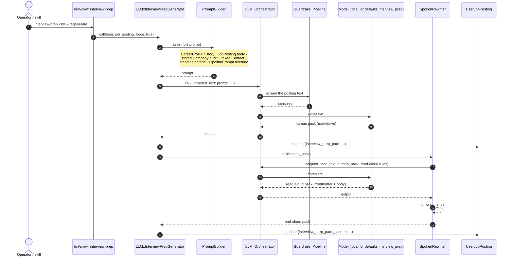
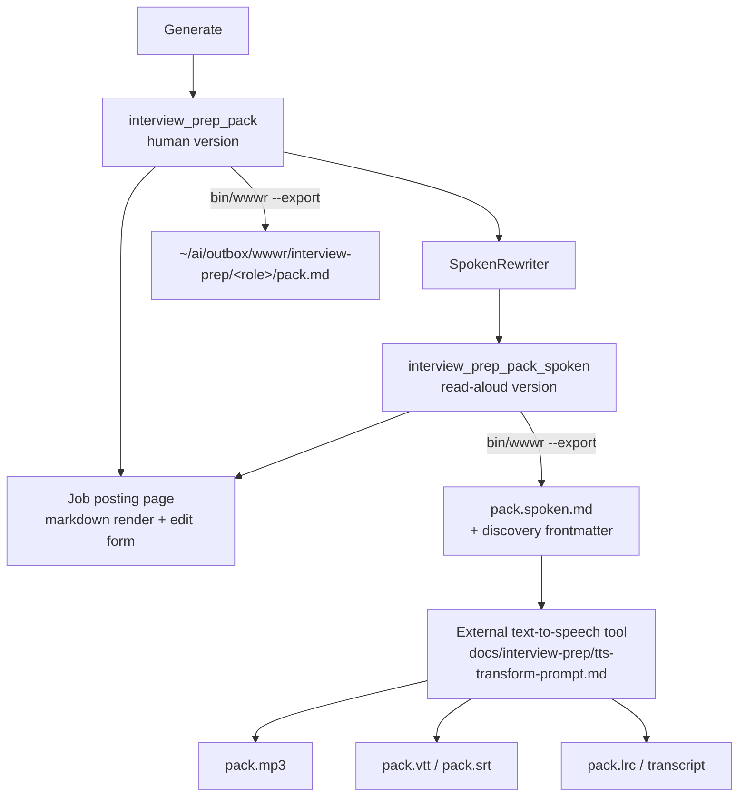
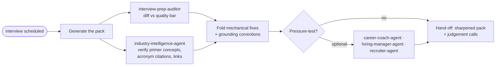

# Interview prep tooling

The **interview prep pack** is a bespoke briefing per `(candidate, posting)`: role setup,
domain primer, story arc, company hooks, referral play, likely questions, questions to ask,
night-before checklist. It ships in two versions with identical content — a **human** version
and a **read-aloud** version for text-to-speech.

## Surfaces

| Surface | Entry point |
|---|---|
| Job posting page | "Generate Prep Pack" button → `generate_interview_prep` action; renders the pack and a "Read-aloud version" toggle |
| CLI | `bin/wwwr interview-prep <id> [--regenerate] [--spoken] [--export[=<role>]]` (`bin/wwwr help interview-prep`) |
| Skill | `interview-prep` — generate, then audit and ground before hand-off |
| Agent | `interview-prep-auditor` — read-only diff against the quality bar |
| Export | `~/ai/outbox/wwwr/interview-prep/<role>/pack.md` + `pack.spoken.md` |

## Generation and read-aloud rewrite

> [!NOTE]
> The read-aloud version is a **rewrite of the human version**, not an independent
> generation, so the two carry identical content. A failed rewrite is non-fatal — the human
> pack still lands and `interview_prep_pack_spoken` stays null.

## The pack lifecycle

On `--export` the read-aloud frontmatter is re-serialized: discovery keys first
(`format: read-aloud`, `kind`, `lang`, `source`, `generated_at`) so a directory scan can
identify and load the file, then the model's content hints (`title`, `pronunciation`,
`sections`, `spoken_minutes`). The re-serialization also repairs a malformed model block into
valid YAML.

## The skill's audit and grounding loop

The quality bar is `docs/interview-prep/_reference/reference.md` (a hand-written,
fully synthetic worked example). The local model's structure is reliable; its
content is a scaffold — see the skill's "known failure modes" section.

## Key components

| Component | Role |
|---|---|
| `LLM::InterviewPrepGenerator` | Orchestrates generation + the read-aloud rewrite; stores both on `UserJobPosting` |
| `LLM::InterviewPrepGenerator::PromptBuilder` | Assembles the human-pack prompt; `PipelinePrompt` key `interview_prep_pack` |
| `LLM::InterviewPrepGenerator::SpokenRewriter` | Rewrites the human pack for text-to-speech per `docs/interview-prep/tts-readable-documentation.md` |
| `UserJobPosting#spoken_pack_parts` | Splits the read-aloud frontmatter from the body |
| `Wwwr::InterviewPrep` | CLI logic: print / regenerate / `--spoken` / `--export` |
| `UserJobPostingsController#generate_interview_prep` | The page button; shares `#run_llm` with match + cover-letter |

## Related docs

- `docs/interview-prep/README.md` — the feature docs index
- `docs/interview-prep/tts-readable-documentation.md` — the read-aloud authoring standard
- `docs/interview-prep/tts-transform-prompt.md` — detection + delivery prompt for the TTS tool
- `docs/interview-prep/tts-integration-guide.md` — wiring the TTS tool
- `TASK-145` — `LLM::Orchestrator` is broken on the Gemini provider; blocks a stronger model on this path
