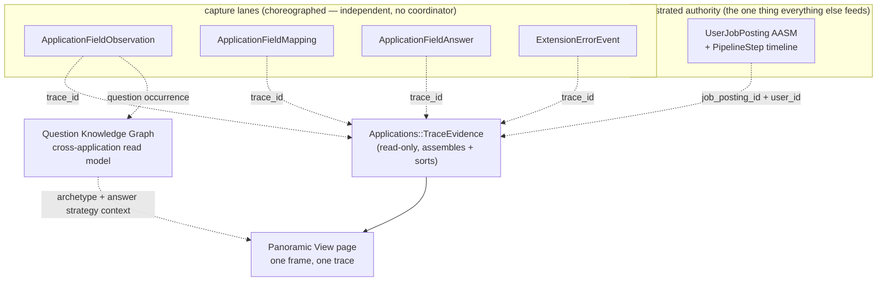

# Panoramic View: An Honest, Trace-Correlated Timeline of One Application

**Status: design, not yet built.** This documents a proposed capability, using the platform's own
prior art (both a 2023-era methodology and a live 2026 reimplementation) as precedent, and this
repo's own already-built-but-unwired data as the concrete hook.

## Where the name comes from

"Panoramic View" isn't a zdots-platform feature this repo can call into — the platform's own
instance lives in `context-engine` (`~/my`), one component of the four-repo zdots platform
(zdots/adots/vdots/`~/my`), live at `my.localhost/panoramic`. wwworkremote has no dependency on
it and shouldn't take one; this doc borrows the *pattern*, not the code.

The name has two prior implementations, and the difference between them is the whole design
lesson:

**2023-2024, a former employer.** Mike manually recorded a colleague's browser session as a HAR
file while she walked through a full loan-origination flow, then hand-correlated that HAR against
Nginx, Rails, and MuleSoft logs — stitched together by a shared "Landable Cookie ID" — into one
continuous timeline of a real customer transaction. The philosophy behind it, named directly in
his own notes, was **Reality-Driven Development**: ground decisions in *observed* system
behavior, not assumed logic or stale documentation. It was built, in his words, as
"architectural forensics" against institutional decay — proof that a business process everyone
had opinions about could be *measured*, not argued over.

**2026, the zdots platform's `context-engine`.** A much leaner reimplementation, and
deliberately re-scoped for a different constraint: `context-engine` sits near PHI-adjacent data,
so unlike the OMF version it captures **zero business content**. `Panoramic::RequestLog`
(`app/middleware/panoramic/request_log.rb`) emits one JSONL line per request with only
timestamp, service name, a derived `trace_id`, route, status, and duration — explicitly excluding
params, headers, bodies, and SQL. `Panoramic::RuntimeEvidence`
(`app/services/panoramic/runtime_evidence.rb`) assembles a live, read-only health pass across the
platform's seams (the app itself, Postgres, local inference/embedding services, the Bus) into a
"lane"-categorized event timeline, cached 10s by default or refreshed on demand
(`?observe=1`). The page (`app/views/panoramic/index.html.erb`) is one frame: a static topology
diagram of the platform's three lanes *and* that live evidence feed, rendered together. It also
does something the OMF version never did — it explicitly narrates its own limits, in a
`noop_trace` block: *"business_mutation: not evaluated," "message_post: not evaluated,"* etc.
Absence stated plainly, not implied by silence.

## Why wwworkremote is a better fit for the richer version

wwworkremote has no PHI constraint — it's Mike's own job-search data. There's no reason to strip
content the way `context-engine` must. The right synthesis is: **the OMF version's content**
(what actually happened, in detail) presented with **the zdots-platform version's discipline**
(one correlation id, lane-categorized, explicitly honest about what's absent, read-only, cheap by
default).

**One assumption this doc leans on that doesn't hold once the source is a remote site's own
traffic**: `trace_id` propagating "for free" across the four capture tables only works because
those rows are written by wwworkremote's own code. A recorded LinkedIn, Greenhouse, or Workday
session has no such propagation — the remote site has never heard of wwworkremote's `trace_id`.
See [Signature Registry](signature-registry.md) for the mapping layer that gap actually needs;
this doc's "hook that's already built" section below still holds for wwworkremote's *own* rows,
it just isn't the whole story once a capture originates outside this app.

## The hook that's already built

Four tables already carry an indexed `trace_id` column, written by the extension today, read by
nothing:

| Table | What it records | Trace-relevant fields |
|---|---|---|
| `application_field_observations` | Every ATS field the extension saw, whether or not it got answered | `field_label`, `page_url`, `page_step`, `observed_at` |
| `application_field_mappings` | The semantic association history for a field (append-only — a correction is a new row, not an overwrite) | `semantic_key`, `provider`, `source_kind`, `mapped_at` |
| `application_field_answers` | The last value actually submitted for a field | `answer_source`, `page_url`, `provided_at` |
| `extension_error_events` | Capture failures | `event_name`, `phase`, `recoverable`, `occurred_at` |

`UserJobPosting#application_trace_id` is the fifth piece — set once per real application session
(`app/controllers/api/v0/application_field_answers_controller.rb`,
`.../application_field_mappings_controller.rb`) but never read back anywhere. Today, answering
"what actually happened when Mike applied to this posting" means opening four different tables by
hand. `PipelineStep` (no `trace_id` of its own, joined by `job_posting_id` + `user_id`) is the
sixth lane — the pipeline-stage/outcome events already rendered as a timeline on
`job_postings/show.html.erb`, but never joined against the field-level capture evidence sitting a
table away.

## Proposed shape

**`Applications::TraceEvidence`** — a read-only service mirroring `Panoramic::RuntimeEvidence`'s
shape exactly: given a `UserJobPosting`, pull every row across the four `trace_id`-scoped tables
plus its `PipelineStep`s, normalize each into `{timestamp, lane, kind, label, source}`, sort
chronologically, and — the discipline worth keeping — say plainly what's *absent*: no
`ExtensionErrorEvent` rows means a clean capture, not nothing to report; no
`ApplicationFieldAnswer` for an observed field means it was seen but never filled, which is
itself a real fact about that application.

**Lanes**, mapped to this repo's real subsystems (not `context-engine`'s):
`capture` (observations) → `mapping` (semantic association) → `answer` (what was submitted) →
`pipeline` (status/outcome) → `human` (HumanTask proposals + decisions) → `error` (capture
failures).

**The page** — one frame per tracked application, entered from `job_postings/show.html.erb`
(a "View full trace" link next to the existing pipeline timeline, appearing whenever
`application_trace_id` is present) and from the `/admin/human_tasks` inbox. Read-only, no writes,
cheap: this is a *view* over data that already exists, not a new write path.

The [Application Question Knowledge Graph](application-question-knowledge-graph.md)
is a second read perspective over observation history. Panoramic View answers
“what happened in this application?”; the question graph answers “what repeats
across applications, companies, industries, and outcomes?” Neither read model
owns workflow state or silently promotes an observed answer into a template.

## Orchestration vs. choreography — answered, not just named

This capability doesn't change the answer given earlier this session, it depends on it staying
true: **choreographed at the edges, orchestrated at the center.** The four capture tables and
`ExtensionErrorEvent` are independent, uncoordinated event sources — each content script writes
what it saw, with no knowledge of the others. `UserJobPosting`'s AASM + `PipelineStep` is the one
orchestrated authority everything else is judged against (why Camunda was rejected earlier this
session — a second orchestrator competing with the one that already exists). **Panoramic View is
neither** — it's a third thing, a read-only *narrator* over both, exactly like
`Panoramic::RuntimeEvidence` is for `context-engine`'s own seams. It must never become a place
that writes state; the moment it does, it's either a redundant orchestrator or an ad hoc one, and
this repo already rejected both shapes once this session.

## What exists vs. what's deferred

| Piece | Status |
|---|---|
| `trace_id` columns + indexes on all 4 capture tables | Built, populated by the extension, unread |
| `UserJobPosting#application_trace_id` | Built, write-only |
| `PipelineStep` timeline | Built, rendered, but not joined to capture-lane evidence |
| `Applications::TraceEvidence` | **Not built** — this doc's actual proposal |
| Panoramic View page + routes | **Not built** |
| "View full trace" entry point on the job posting page | **Not built** |
| Backfilling `application_trace_id` for pre-existing untraced applications | **Open question** — not attempted, not scoped |
| Persisting the HAR/DOM capture itself (not just the parsed fields) as a replayable artifact | **Deferred to TASK-112** — guided sessions will capture meaningful transitions and intent, not indiscriminate telemetry |
| Correlating a *remotely-recorded* session (no automatic trace propagation possible) | **Deferred to [Signature Registry](signature-registry.md)** — a real gap in this doc's propagation assumption, not just an extension |

## Open questions for Mike

1. Route placement — `/admin/panoramic/:trace_id`, or nested under the job posting
   (`/job_postings/:id/trace`)? Admin-only either way, matching this app's existing gate.
2. Is a trace worth building for applications that predate `application_trace_id` (most of the 60
   currently `applied`) via the `job_posting_id`+`user_id` join alone, or is "no trace_id, no
   Panoramic View entry" an acceptable and honest starting boundary?
3. Worth the raw-HAR-capture extension (last item in the deferred table) as a fast-follow, or is
   the field-level correlation enough on its own?

## Visualization model (captured 2026-08-27, not yet built into any view)

A mental model developed in conversation for rendering one traced application, worth recording
before it's lost:

- **Left-to-right = the actor's journey.** Leftmost is the actor's starting state — who they are
  (or what, for an API/AI actor), what they brought (persona, goals), what success and failure
  mean to them. Each step moves right.
- **Vertical = depth through the topology per step**, not a generic call stack — the same "lanes"
  concept from this doc's own topology (capture / orchestrated / platform), so the wave
  propagates *through* the actual system architecture, not an abstract axis. One step's round
  trip (DOM → extension → API → service → DB → response) is one trough-to-peak of a sinusoidal
  wave; async/fire-and-forget calls branch off the main wave rather than sitting on it.
- **Stacked cross-sections, CT/MRI-style.** Multiple point-in-time snapshots (OpenTelemetry-style
  service maps) stacked along **time and distance** as the two slicing intervals reconstruct a
  volumetric model of the whole traced run, the way radiological imaging reconstructs a 3D
  structure from 2D slices. Timeseries data matters most exactly where it's actually available
  (Greenhouse's exact `applied_at` vs. LinkedIn's relative-age approximation is the same
  precision gap this session's `Applications::RowImporter` work already had to account for).

**Also flagged, not yet acted on:** ground the Reference Scenario concept in job-application
workflow patterns that are common knowledge, not just what's been directly observed so far —
common ATS states (applied, screening, phone screen, interview loop, offer, rejected, withdrawn)
and common system shapes (Greenhouse, Lever, Workday, iCIMS, Taleo, SmartRecruiters) beyond the
four providers this doc and Signature Registry currently name. This wasn't invented from nothing;
don't design the Reference Scenario's expected shape as if it were.

The next implementation seam is the supervised application session: a durable pump-track lap
that starts from a copied posting URL, records meaningful transitions and Mike's intent, and
pauses at ambiguous or irreversible actions. See [ADR 005](../adr/005-supervised-intent-capture.md)
and TASK-112.
