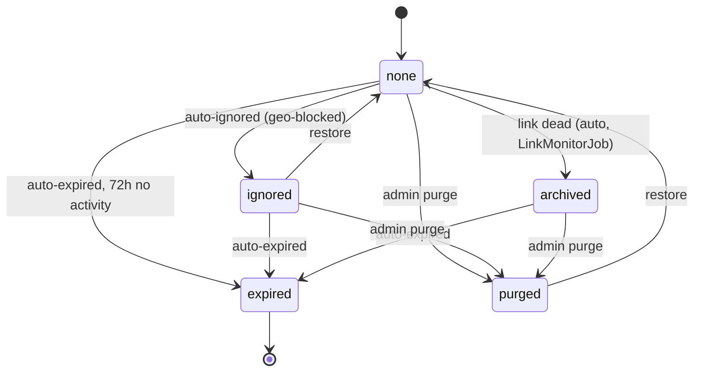
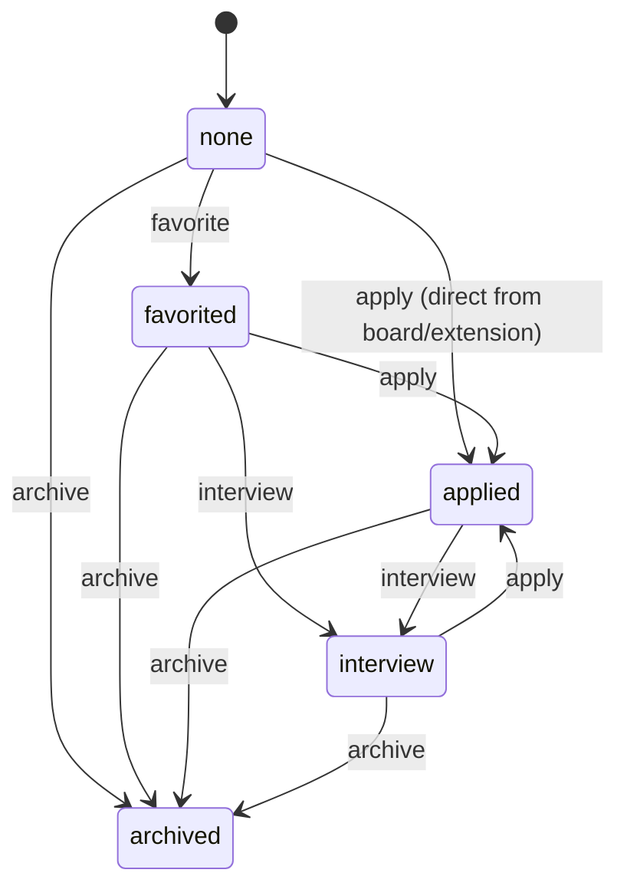
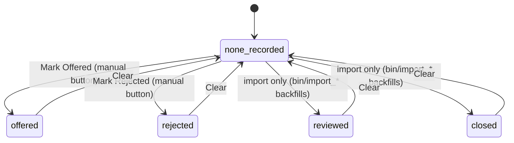

# The Application Pipeline: Three Independent State Machines

The job-application pipeline isn't one state machine — it's three, tracking three different
kinds of fact that all get conflated if you try to squeeze them into one `status` column. This
split was made explicit while fixing **TASK-82** (see `backlog/tasks/` — Backlog.md MCP task, not a docs/ file):

1. **Posting lifecycle** (`JobPosting`) — facts about the listing itself, true or false regardless
   of what Mike does. A posting can be `expired` whether or not he ever looked at it.
2. **Pipeline stage** (`UserJobPosting#status`) — where Mike is in the process of pursuing it.
   Applied, interviewing, etc. — things *he* does.
3. **Employer outcome** (`UserJobPosting#outcome`) — the employer's decision, independent of stage.
   "Interviewed then declined" and "applied and silent" are different facts the stage alone can't
   hold — an application can be declined at any stage, not just at the end.

This maps to the same shape CRM pipelines use (Salesforce splits `StageName` from `IsWon`), and
to how ATS tools like Greenhouse work — a candidate's *stage* is separate from their *disposition*.

## 1. Posting lifecycle (`JobPosting.status`)

Properties of the posting, not of Mike's relationship to it. As of **TASK-82 phase 3**
(2026-08-26), this AASM holds *only* lifecycle facts — no pipeline-stage value has lived here
since phase 1's dual-write mirror was removed.

`archived` here means "the listing's link died," not "Mike gave up" — that fact lives on
`UserJobPosting.status` (below). Both use the word "archived" for different reasons; see
`Pipeline::DisplayStatus` at the bottom of this doc for how a caller picks the right one to show.
Note `archived` has no `restore` transition of its own — getting back to `none` from a dead-link
archive goes through `purge` then `restore`, or `expire`.

## 2. Pipeline stage (`UserJobPosting.status`) — what Mike does

`offered` is **not** a state here — resolved by **TASK-94**: it's the employer's decision, the
same *kind* of fact as `rejected` below, not a stage Mike walks through. It lives on the outcome
axis (section 3) instead. There's also no `archived --> favorited` re-open event in the current
AASM; archiving from this side is currently one-way.

## 3. Employer outcome (`UserJobPosting.outcome`) — independent of stage

Deliberately independent of stage 2 above — an outcome can be recorded at any pipeline stage.
`outcome_at` and `outcome_source` travel with it (`MANUAL_OUTCOMES` in
`UserJobPostingsController`). Only "Mark Offered"/"Mark Rejected" have UI buttons today
(`job_postings/show.html.erb`) — `reviewed`/`closed` are written exclusively by the import
scripts, using the same fixed vocabulary so a manually-logged and an imported outcome render
identically. **TASK-91** adds a reason and an email attachment to this record, and derives a
per-company cooldown from it.

## Reading all three at once: `Pipeline::DisplayStatus`

Nothing above merges — each stays its own model, per TASK-82. What changed (2026-08-27) is that
answering "what badge should I show for this posting+user" used to mean every caller re-deriving
its own precedence chain; now `Pipeline::DisplayStatus` (`app/services/pipeline/display_status.rb`)
is the one seam:

- `.call(job_posting:, user_job:)` — lifecycle (section 1) beats outcome (section 3) beats
  pipeline stage (section 2). JobPosting's own `archived` wins over UserJobPosting's `archived`
  when both are true, since a dead link outranks an old pipeline decision as the more current fact.
- `.outcome(user_job)` — just the outcome tier, for callers that already know the pipeline stage
  from context (e.g. a list already filtered to `status: "applied"`) and only need the outcome
  label.

Both return a semantic key + label, never CSS — each caller (`job_postings/show.html.erb`,
`user_job_postings/index.html.erb`) keeps its own badge markup, since the two views use different
visual idioms for the same concept.

## Acting on stage 2 going stale: `UserJobPosting.idle` (TASK-93)

A separate concern from the above (nothing here touches `Pipeline::DisplayStatus`) but reads the
same two models: `UserJobPosting.idle` finds postings with active pipeline involvement
(favorited/applied/interview) that have had no `PipelineStep` in `IDLE_AFTER` (3 days), excluding
anything that's reached a terminal outcome or lifecycle state. Surfaced as a persistent "Needs
Follow-up" section on the home dashboard (`HomeController#assign_idle_followups`), not a toast or
external notification — see the task's implementation notes for why (no email/Slack/push channel
exists in this app, and an ephemeral toast defeats the point of catching things Mike isn't
currently looking at).

Two SQL gotchas worth knowing if this scope needs touching again:
- `where.not(outcome: [...])` silently drops rows where `outcome IS NULL` (SQL's `NOT IN` never
  matches `NULL`) — since `outcome` is `NULL` for nearly every actively-tracked posting, the naive
  form matched almost nothing. Written as `"outcome IS NULL OR outcome NOT IN (?)"` instead.
- A row can have **zero** `PipelineStep`s ever, not just none *recently* — the backfill importers
  (`bin/import_indeed_applications`, `bin/import_linkedin_tracker`) write `status` directly and
  never log one. `LAST_ACTIVITY_SQL` (`UserJobPosting`) `COALESCE`s to the row's own `created_at`
  so a freshly-imported row doesn't read as instantly idle, and `#last_pipeline_activity_at`
  mirrors the same fallback so the two can't drift apart.
