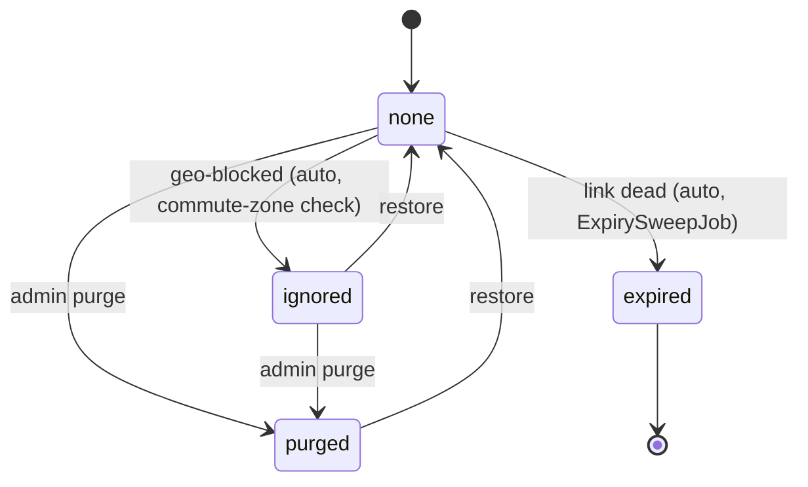
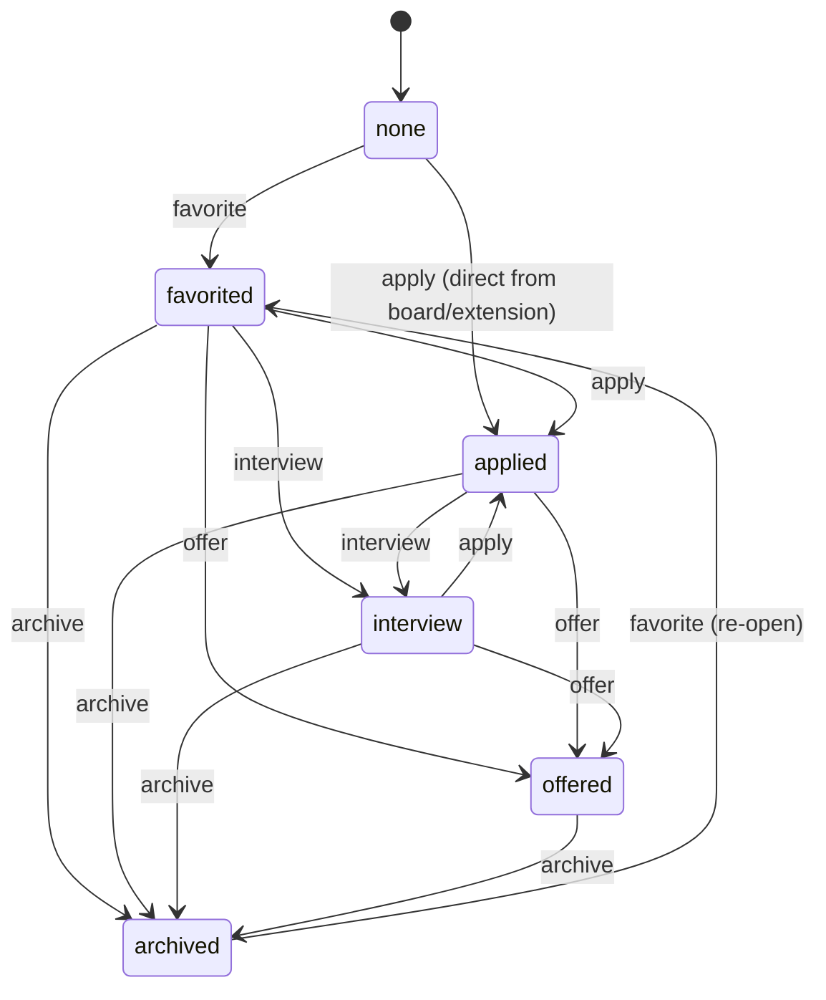
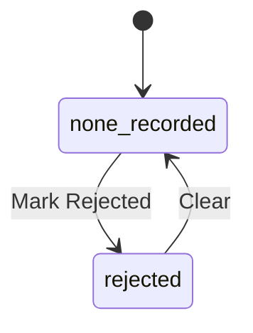

# The Application Pipeline: Three Independent State Machines

The job-application pipeline isn't one state machine — it's three, tracking three different
kinds of fact that all get conflated if you try to squeeze them into one `status` column. This
split was made explicit while fixing **TASK-82** (see `backlog/tasks/` — Backlog.md MCP task, not a docs/ file):

1. **Posting lifecycle** (`JobPosting`) — facts about the listing itself, true or false regardless
   of what Mike does. A posting can be `expired` whether or not he ever looked at it.
2. **Pipeline stage** (`UserJobPosting#status`) — where Mike is in the process of pursuing it.
   Applied, interviewing, etc. — things *he* does.
3. **Employer outcome** (`UserJobPosting#outcome`) — the employer's decision, independent of stage.
   "Interviewed then declined" and "applied and silent" are different facts the stage alone can't
   hold — an application can be declined at any stage, not just at the end.

This maps to the same shape CRM pipelines use (Salesforce splits `StageName` from `IsWon`), and
to how ATS tools like Greenhouse work — a candidate's *stage* is separate from their *disposition*.

## 1. Posting lifecycle (`JobPosting.status`)

Properties of the posting, not of Mike's relationship to it.

> **Current-state note:** `JobPosting.status` today *also* still holds the pipeline-stage values
> (`favorited`, `applied`, `interview`, `offered`, `archived`) as a synced mirror of
> `UserJobPosting.status` — that's TASK-82 phase 1 (the dual-write fix), not the target shape.
> Phase 3 removes those values from `JobPosting` entirely, leaving only what's diagrammed above.

## 2. Pipeline stage (`UserJobPosting.status`) — what Mike does

> **Open question, not yet resolved:** Mike pointed out live that `offered` doesn't really belong
> here — it's the employer's decision, the same *kind* of fact as `rejected` below, not a stage he
> walks through like "applied" or "interview" are. Moving it onto the outcome axis is in scope for
> **TASK-94** (the statechart prior-art spike).

## 3. Employer outcome (`UserJobPosting.outcome`) — independent of stage

Deliberately independent of stage 2 above — an outcome can be recorded at any pipeline stage.
`outcome_at` and `outcome_source` travel with it. **TASK-91** adds a reason and an email
attachment to this record, and derives a per-company cooldown from it.
