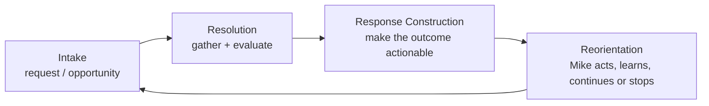

# The Job Application Pump Track

WWWorkRemote treats the job search as a game that continues through changing
terrain. A posting-to-application flow is one lap, not a one-way funnel.

The four phases are stable even when a provider adds a unique subflow:

| Pump-track section | Pipeline phase | Question |
| --- | --- | --- |
| Drop-in | Intake | What is being requested or selected? |
| Bottom | Resolution | What did the system discover or decide? |
| Climb | Response Construction | What should the actor see or do next? |
| Berm | Reorientation | Continue the lap, change strategy, or stop? |

The product's job is to preserve momentum: carry useful context forward,
surface the next move, and turn every result into better footing for the next
lap. Employment changes the terrain; it does not end the game.

See [ADR 004: Model the Job Search as a Pump Track](../adr/004-pump-track-job-application-loop.md)
for the architectural decision.
