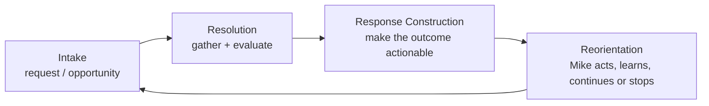

# The Job Application Pump Track

WWWorkRemote treats the job search as a game that continues through changing
terrain. A posting-to-application flow is one lap, not a one-way funnel.

The four phases are stable even when a provider adds a unique subflow:

| Pump-track section | Pipeline phase | Question |
| --- | --- | --- |
| Drop-in | Intake | What is being requested or selected? |
| Bottom | Resolution | What did the system discover or decide? |
| Climb | Response Construction | What should the actor see or do next? |
| Berm | Reorientation | Continue the lap, change strategy, or stop? |

The product's job is to preserve momentum: carry useful context forward,
surface the next move, and turn every result into better footing for the next
lap. Employment changes the terrain; it does not end the game.

See [ADR 004: Model the Job Search as a Pump Track](../adr/004-pump-track-job-application-loop.md)
for the architectural decision.

For the operational validation scheme—Service Tasks, User Tasks, gateways,
approval interrupts, and the continue/stop loop—see [Guided Session Flow](guided-session-flow.md)
and [ADR 006](../adr/006-bpmn-lite-guided-session-validation.md).

## Metaphor Harmony: The Embodied Rider & The Forensic Observer

The Pump Track does not operate in isolation. It forms the physical, kinetic core of
a dual-metaphor architecture:

1. **The Embodied Rider**:
   - **The Pump Track**: Generates and preserves momentum across cyclical laps.
   - **The Harness** ([ADR 005](../adr/005-supervised-intent-capture.md)): Safety gear
     worn by the operator. Automation provides telemetry and drafting, but locks at
     **Commitment Boundaries** (irreversible submission, data transmission) to preserve
     human agency.
   - **The Correlation Spine** ([ADR 010](../adr/010-link-to-application-capture-and-the-datalake.md)):
     The `session_token` anchors all telemetry (DOM, HAR, screenshots, answers) to one
     anatomical structure.

2. **The Forensic Observer**:
   - When a lap completes, the system shifts to retrospective inquiry.
   - **Datalake Modality** ([Architecture](datalake.md)): Captures raw telemetry
     without schema forcing; derives structure on read.
   - **Paleontological Taxonomy** ([Signature Registry](signature-registry.md), [ADR 008](../adr/008-preserve-question-occurrences-before-archetype-clustering.md)):
     Treats observed questions as pristine *Occurrences* (fossils) grouped into *Archetypes*
     (taxa) and diffed against *Reference Scenarios* (holotypes) to detect true *Drift*.
   - **Panoramic View** ([Architecture](panoramic-view.md)): Wide-angle system cartography
     narrating observed truth and explicitly stating absence (`noop_trace`).

Kinetic momentum in the moment; forensic truth in retrospective.
