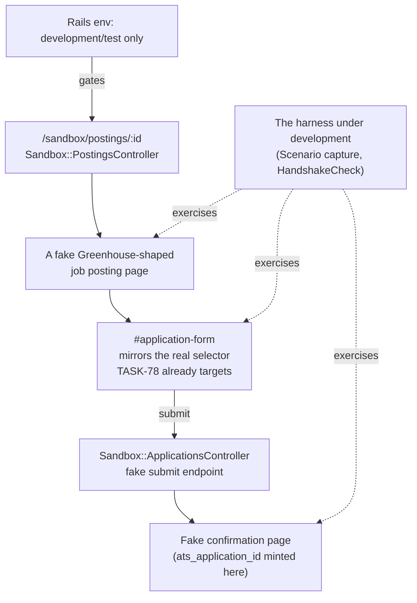

# Sandbox Provider: A Fake ATS to Build the Harness Against Safely

**Status: design, not yet built.** The piece [Signature Registry](signature-registry.md) needs to
build and iterate a [Reference Scenario](signature-registry.md#reference-scenario--the-golden-master-not-a-platonic-ideal)
without every iteration requiring Mike to be logged into a real third-party site.

## The problem this solves

Everything in Signature Registry needs somewhere safe to run against while it's being built:
`Scenario`/`ScenarioSignature` capture, `Scenarios::HandshakeCheck`, and eventually a Reference
Scenario per provider. Building and testing that harness directly against a real Greenhouse or
Workday apply flow means either real credentialed access every time (slow, not automatable, and
risks a real accidental submission) or guessing at DOM shape (exactly what TASK-83 AC #7 —
"every selector live-verified against a live capture, not guessed" — exists to prevent).

A **sandbox provider** is a fake job posting + apply flow, served from `wwworkremote.localhost`
itself, built to resemble a real ATS's DOM closely enough that the harness can be developed,
exercised, and automated against it exactly as if it were the real thing — with only the *final*
verification step against a real site needing Mike logged in.

## Which provider first, and why

**Greenhouse**, not LinkedIn or Workday. Three reasons:

1. It's TASK-83 AC #6 itself — "a Greenhouse submit is captured even when the posting was not
   already tracked with a `wwr_id`" — so a Greenhouse-shaped fixture is directly useful, not a
   detour.
2. TASK-78 already built a real capture-phase `submit` listener targeting a real, known selector
   (`#application-form`) against the real Greenhouse DOM shape. The fixture mirrors a selector
   this repo already trusts, not a guess.
3. Greenhouse's real shape (a single-page form, standard fields, a submit button, no wizard) is
   the simplest of the four target providers. LinkedIn's Easy Apply modal and Workday's
   multi-step, per-tenant candidate portal are structurally different enough that they earn their
   own, later fixtures rather than one fixture pretending to be all four.

## Shape

**Environment-gated, hard.** The route doesn't exist (not just "returns 403") unless
`Rails.env.local?` — the sandbox provider must never be reachable in production, and the extension
must never be able to mistake a real user's session for fixture data. Gate both the Rails route
and the extension's own provider-recognition list on the same condition, so a build with the
sandbox wired in can't accidentally treat a real site as fixture data or vice versa.

**Mirrors real structure, not real content.** The posting page and form reuse Greenhouse's actual
field ids/classes/structure (verified against what TASK-78's real listener already targets), with
placeholder job/company copy — not a copy of any real employer's actual posting.

**The fake submit mints the signatures a real one would.** `Sandbox::ApplicationsController#create`
generates a fake `job_post_id` (present from page load, matching `SIGNATURE_EXPECTATIONS`'s
`required` for that kind) and a fake `ats_application_id` only at the confirmation step (matching
`required_after_submit`) — so the fixture actually exercises the step-awareness gap
`HandshakeCheck` and the Reference Scenario are meant to close, not just the easy always-present
case.

## Worth considering while the harness is being built: on-device inference

Modern Chrome ships built-in AI — the Prompt API, Summarizer, Writer/Rewriter, Language Detector —
running on-device via Gemini Nano, available to extensions, no network round-trip. This repo's
extension already does some of this work server-side today
(`ApplicationFieldQuestionClassifier`, `LLM::Orchestrator`); some of it is a plausible fit for
on-device inference instead, specifically:

- **Sense-making's first pass** — classifying an unfamiliar field on an unknown provider ("is this
  a work-authorization question, a demographic question, a free-text prompt") is exactly the kind
  of cheap, low-stakes classification on-device inference is good at, before anything escalates to
  the backend LLM.
- **Load distribution** — every content-script classification that stays on-device is one that
  never hits `LLM::Orchestrator`, with zero added latency from a network round-trip.

Not a commitment to build — a real capability worth evaluating once the harness has something
concrete to point it at, not designed in the abstract. See TASK-108.

## What this unblocks

- **Phase A** of the Reference Scenario plan (automatic walkthroughs, safe and repeatable) has
  somewhere to run.
- TASK-83 AC #6 becomes directly testable: a posting with no pre-set `wwr_id`, submitted through
  a Greenhouse-shaped form, either gets captured correctly or doesn't — mechanically checkable.
- Selector development for the eventual LinkedIn/Workday fixtures gets a working pattern to copy
  rather than starting from nothing.

## What exists vs. what's deferred

| Piece | Status |
|---|---|
| TASK-78's real `#application-form` submit listener (the selector this fixture mirrors) | Built, in the extension |
| `Sandbox::PostingsController` / `Sandbox::ApplicationsController` | **Not built** |
| The fake Greenhouse-shaped posting + form views | **Not built** |
| Env-gating (route + extension provider list) | **Not built** |
| Anything that runs an *automatic* walkthrough against it (Phase A itself) | **Not built** — depends on the `Scenario` capture path also being built (see Signature Registry) |
| LinkedIn / Workday sandbox fixtures | **Deferred** — Greenhouse first, on purpose |

## Open questions

1. Automatic walkthrough driver — a headless browser (Capybara/Cuprite, already likely available
   in a Rails test suite) driving the sandbox provider directly, or the actual Chrome extension
   pointed at `wwworkremote.localhost` the same way it'd point at a real site? The latter tests
   the real extension code path; the former is simpler to automate in CI-style runs.
2. Does the sandbox provider live under `app/` behind the env gate, or under `spec/` as pure test
   fixture infrastructure? Living under `app/` lets it be driven manually in a browser during
   development, not just from a test suite — probably worth the extra visibility, not decided.
