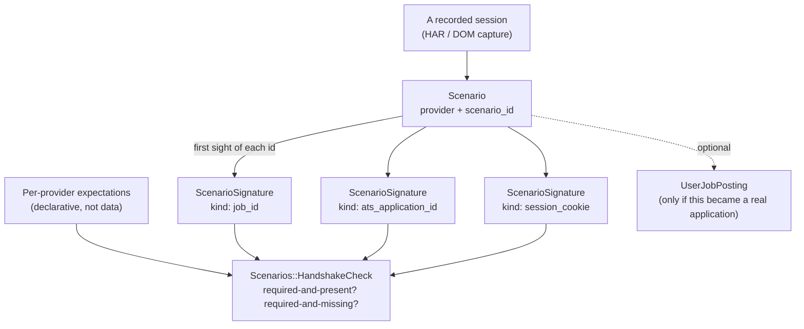

# Signature Registry: Mapping a Scenario Against What a Remote Site Actually Says

**Status: `Scenario`/`ScenarioSignature`/`HandshakeCheck` built (2026-08-27); `Scenarios::Capture`
(2026-08-27, TASK-102) turns a HAR or DOM capture into real rows.** This is the piece [Panoramic View](panoramic-view.md) silently assumed
away, and the mechanism TASK-83's blocked AC #7 (every selector verified against a live capture,
not guessed) actually needs to become checkable rather than eyeballed.

## The assumption that doesn't hold

Panoramic View's design leans on `trace_id` propagating for free across the four capture tables,
because those rows are all written by wwworkremote's own code — the extension sets `trace_id`
itself, so of course it's consistent everywhere.

That assumption breaks the moment what's being observed is a **remote site's own traffic**: a
recorded LinkedIn, Greenhouse, or Workday session. Those sites have never heard of
wwworkremote's `trace_id` and never will — there's no `traceparent` header, no shared cookie, no
propagation mechanism at all, because propagation requires *both* ends to participate. This is
exactly the wall the original 2023 OMF version hit and solved by hand (correlating a HAR against
server logs via a cookie ID nobody designed for that purpose). Recording sessions from remote
sites to test selectors against, or to backfill applications from, means solving the same problem
again — deliberately this time, not by hand.

## Three things, not one

The trace-correlation half of Panoramic View conflated these into a single `trace_id` column.
They're actually three separate concepts:

1. **The scenario identifier** — wwworkremote's own, owned end-to-end, generated the moment a
   recording starts. A distinct concept from `application_trace_id` (see `Scenario` below), not a
   generalization of it — the harness's super-identifier exists whether or not a real application
   ever results.
2. **The signature identities encountered along the way** — the remote site's *own* native ids,
   observed incidentally as the capture proceeds: a LinkedIn job id in a URL, a Greenhouse
   `job_post_id`, an ATS candidate/session id, sometimes a request id inside a network call.
   Heterogeneous, provider-specific, not every kind present in every capture.
3. **The mapping between the two**, recorded at the moment each signature is first observed — the
   handshake — plus a per-provider notion of which signatures are *expected* at which step
   (required) versus merely present-if-available (optional). A missing optional signature is
   normal. A missing required one is a real gap: the capture broke, or a selector needs fixing.

`Applications::PostingMatcher` is the closest existing prior art and still isn't this: it answers
"which `JobPosting` is this," one lookup against one signature. The registry is the running ledger
of *every* external identity a scenario has touched, and whether each was supposed to show up.

## Proposed shape



### `Scenario`

One row per **deliberately recorded** session — Mike consciously starting a capture, whether or
not it results in a real application (the TASK-83 AC #7 case: visiting a Workday candidate-home
page to let a selector be checked against it, never applying). Scoped to that case only, not to
every capture this app processes — the routine LinkedIn/Greenhouse/Indeed HAR backfills stay
exactly as `Applications::RowImporter` already runs them; `Scenario` doesn't become a second path
that already-working code has to route through. That's also why `Scenario` doesn't belong on
`UserJobPosting` the way `application_trace_id` does today — requiring a tracked application
before a scenario can exist would make the verification-only case impossible to represent.
`UserJobPosting` becomes an optional, nullable link *from* `Scenario`, set only when a
scenario turns out to correspond to (or produce) a real tracked application.

**`scenario_token` is its own super-identifier, not derived from `application_trace_id`.** These
are different concepts at different scopes, resolved 2026-08-27: `application_trace_id` means
specifically "this application generated a trace" — it only exists once a real application does.
`Scenario#scenario_token` is generated by the harness itself, the moment a recording starts, and
holds the *whole coordinated run* together — every `ScenarioSignature` observed, and, only if and
when one results, the `UserJobPosting` it produced. A scenario that never becomes an application
(the verification-only case) still has a real, complete `scenario_token`; an `application_trace_id`
never would.

Fields: `provider`, `scenario_token` (the harness's own super-identifier, generated at recording
start), `started_at`, `user_job_posting_id` (nullable), `resume_persona_id` (nullable — see below).

**Persona-aware, mirroring `UserJobPosting#resume_persona_id`.** Different personas produce
different answer content for the same form, and some ATSes branch on answer content (a different
follow-up question depending on what was entered) — so two captures of the "same" provider under
different personas can legitimately diverge in ways that have nothing to do with drift or an
incomplete reference. Without recording which persona was active, a captured `Scenario` can't be
correctly interpreted later, and a real persona-driven divergence risks being misread as the
reference being wrong. `Scenario#resume_persona_id` is nullable — a verification-only capture
against the sandbox provider (Phase A) may have no real persona in play at all. (2026-08-27)

### `ScenarioSignature`

Append-only, same convention `ApplicationFieldMapping` already uses for its own history — a
correction is a new row, not an overwrite, so later tooling can see whether an id changed mid-flow
(a redirect, a re-issued session id) rather than only ever seeing the last one.

Fields: `scenario_id`, `kind` (free string — `job_id`, `ats_application_id`, `session_cookie`,
`request_id`, new kinds arrive with new providers, this is not a fixed enum), `value`, `step`
(mirrors the `page_step` convention already on `ApplicationFieldObservation`/`Mapping`),
`first_observed_at`. Unique on `(scenario_id, kind, value)`.

`kind` is never split inline. **`Scenarios::SignatureKind` (`app/services/scenarios/signature_kind.rb`)
is the single parsing boundary** — every consumer (`ReferenceDiff`, `HandshakeCheck`, coverage,
presentation) classifies a kind through it. A bare kind is an `ats_identity`; the structural
namespaces `field:` / `screening_question:` / `step:` / `commitment_boundary:` (ADR 009) parse to
`:structural`; anything else is `:unknown_namespace`, logged and excluded from structural
conclusions (and raised in dev/test). Screening-question kinds are `screening_question:v1:<sha256>`
of the normalized question text — the `v1` is the normalization version, so a later move to
TASK-113 archetype identity stays an explainable migration.

### Provider expectations

Declarative, not a database table — a plain Ruby constant living on
`Scenarios::HandshakeCheck` itself (`app/services/scenarios/handshake_check.rb`), the same shape
`Applications::RowImporter`'s subclasses already use for per-provider behavior:

```ruby
SIGNATURE_EXPECTATIONS = {
  "linkedin"   => { "job_id" => :required },
  "greenhouse" => { "job_post_id" => :required, "ats_application_id" => :required_after_submit },
  "indeed"     => { "job_key" => :required },
  "workday"    => { "tenant_id" => :required, "candidate_id" => :optional }
}.freeze
```

`:required_after_submit` is checked as plain `:required` for now — a documented ceiling, not yet
step-aware. Upgrade when a scenario with a real pre-submit/post-submit split shows the plain check
giving a false "missing."

### `Scenarios::HandshakeCheck`

Given a `Scenario`, reports each expected `kind` as one of: required-and-present,
**required-and-missing** (the actual finding — capture broke, or the selector needs fixing),
optional-and-present, optional-and-missing (expected, not a problem). This is what makes TASK-83
AC #7 checkable instead of eyeballed: a captured session either produced what that provider
requires, or it names exactly what's missing.

## Two modes, not one loop

"Feed real capture back into the harness" is doing two different jobs, and conflating them loses
the distinction that actually matters:

- **Drift detection** — a *known* provider's shape changed. `HandshakeCheck` already has a
  baseline (`SIGNATURE_EXPECTATIONS["greenhouse"]`) to diff against; a missing required signature
  is a specific, legible gap against something that used to work.
- **Sense-making** — an *unknown* provider, or a known provider doing something structurally new
  (a wizard checkpoint, a review-before-submit screen, a mid-flow "create an account with us
  first" detour). There's no baseline yet. `HandshakeCheck` already handles this gracefully by
  accident, not by design: a provider absent from `SIGNATURE_EXPECTATIONS` returns `[]`, not an
  error — the honest state for "nothing to check yet, because nothing's been understood yet." The
  first real capture against a new system isn't a check, it's raw material a human (or an LLM
  session) reads once to *propose* what that provider's entry should be. Sense-making produces the
  schema; drift detection maintains it afterward.

Neither is reinforcement learning, on purpose. RL needs many cheap, repeatable rollouts to learn
from — this repo can't safely have that against real sites (every real trial is either Mike
personally logged in, or an actual job application, not a free retry), and the signal here is
sparse and discrete, not dense and differentiable. When a required signature goes missing, the fix
isn't discovered by search across a space of possibilities — it's diagnosed in one look at the new
DOM. What's actually happening is closer to **golden-master testing with a directed patch step**:
a trusted baseline, a diff against it, and one targeted fix to whichever side was wrong — the
selector, or the baseline itself.

## Reference Scenario — the golden master, not a "platonic ideal"

The trusted baseline above needs a name and a shape. "Platonic ideal" was the first phrasing on
the table; the more precise, more actionable one is a **Reference Scenario** — literal, not
abstract: an ordinary `Scenario` row whose `ScenarioSignature`s, in the order captured, *are* the
current best understanding of the correct end-to-end sequence for that provider, from the posting
link through to submitted application. One per provider. This resolves
`HandshakeCheck`'s `:required_after_submit` ceiling for free — "required after submit" stops being
an unenforced label and becomes an actual position in a real ordered sequence, once there's a real
sequence to be a position *in*.

**How it gets built and kept honest — two phases, matching the two modes above:**

1. **Automatic walkthroughs against the sandbox provider** (still to be built) construct and
   refine the Reference Scenario in a safe, repeatable environment — sense-making with the volume
   real sites can't safely give, because it's a fixture, not a live application.
2. **Guided runs against real, targeted postings** are drift-detection *of the reference itself*,
   not just of one run. A real capture diverging from the Reference Scenario is either the real
   site drifting (fix the fixture or the selector) or the reference being incomplete — a real,
   legitimate variation it never had (update the reference). Structuring "insights from a guided
   run" means deciding, each time, which of those two happened.

**How that comparison and that decision are structured is [ADR 009](../adr/009-reference-comparison-drift-and-coverage.md).**
A guided session materializes into an ordinary `Scenario` (`Scenarios::Capture.from_guided_session`);
structural dimensions — fields, screening questions, step order, commitment boundaries — become
namespaced `ScenarioSignature` kinds parsed through `Scenarios::SignatureKind`, so `ReferenceDiff`
and `HandshakeCheck` extend rather than fork. Comparison separates **coverage** (how much of the
reference a purpose-bounded run reached) from **drift** (differences within the observed overlap),
and records three persistent layers: `ReferenceComparison` (the run), `ComparisonFinding` (what it
inferred), `FindingDisposition` (what Mike decided). Comparison is advisory — it never authorizes,
blocks, or advances an application.

## What this unblocks

TASK-83's AC #6/#7/#11 are blocked on live access this repo doesn't have unsupervised — Greenhouse's
own apply-flow DOM for a posting with no `wwr_id`, a real Workday candidate-home page. The registry
doesn't remove that blocker (Mike still has to be logged in somewhere to capture *anything*), but
it turns "I recorded a session, does it actually cover what the selector needs" into a repeatable
check instead of a one-off read. The same recording, replayed against `HandshakeCheck` after a
provider changes their DOM, tells you whether the capture still satisfies what that provider
requires — a regression signal TASK-83's own "every selector live-verified" standard doesn't
currently have a mechanism for.

## What exists vs. what's deferred

| Piece | Status |
|---|---|
| `application_trace_id` | Built — stays as-is, a narrower concept than `Scenario#scenario_token` (resolved 2026-08-27) |
| `Applications::PostingMatcher` | Built — the single-lookup case this generalizes |
| `Scenario` / `ScenarioSignature` models | Built (2026-08-27) |
| `Scenarios::HandshakeCheck::SIGNATURE_EXPECTATIONS` per provider | Built (2026-08-27) — lives on the checker itself, not a separate module |
| `Scenarios::HandshakeCheck` | Built (2026-08-27) |
| Anything that actually records a HAR/DOM capture into a `Scenario` | Built (2026-08-27, TASK-102) — `Scenarios::Capture` (`app/services/scenarios/capture.rb`), a standalone capture path, not routed through Panoramic View |
| Sandbox provider (a fake ATS served from `wwworkremote.localhost`, resembling a real one closely enough to exercise the harness against safely) | Built (2026-08-27, TASK-104) — see [Sandbox Provider](sandbox-provider.md) |
| Reference Scenario (golden-master baseline per provider) | Built (2026-08-27, TASK-106) — ReferenceScenario is an explicit one-row-per-provider pointer; promotion is preview-first and manual |
| Greenhouse sandbox Reference Scenario built from a guided execution session | Built (2026-08-28, TASK-118) — `Scenarios::SandboxReferenceWalkthrough` / `rake scenarios:build_sandbox_reference`; full `step:`/`commitment_boundary:`/`field:`/`screening_question:` marker set via `from_guided_session`; reproducible from the sandbox form; browser dogfood is the final confirmation |
| Guided session → `Scenario` materialization (`Scenarios::Capture.from_guided_session`) | Built (2026-08-28, TASK-115) — `Scenarios::GuidedCapture`; emits `step:` / `commitment_boundary:` / `field:` / `screening_question:` markers + ATS ids from value-free event evidence; `GuidedSession#scenario_id` + `ScenarioSignature#source` breadcrumb; deterministic + idempotent. See [ADR 009](../adr/009-reference-comparison-drift-and-coverage.md) |
| `Scenarios::SignatureKind` namespaced-kind value object (`field:` / `screening_question:` / `step:` / `commitment_boundary:`) | Built (2026-08-28, TASK-114) — the single kind-parsing boundary; additive, no consumer wired yet |
| Coverage-vs-drift comparison engine (`Scenarios::ReferenceDiff` dimensions/value-diff, `Scenarios::Coverage`, `Scenarios::DriftAnalysis`, `Scenarios::ComparisonRules::VERSION`) | Built (2026-08-28, TASK-116) — plain-hash output; Reached-Scope-aware so a research run's early stop is coverage, not drift |
| `ReferenceComparison` / `ComparisonFinding` / `FindingDisposition` (persistent runs, findings, dispositions) | Built (2026-08-28, TASK-117) — immutable runs (incl. `no_reference`/`failed`), immutable findings, append-only dispositions; `Scenarios::RecordComparison` maps a `DriftAnalysis` result to rows; `(dimension, locator)` carry-forward scoped by provider + reference is suggestion-only |
| `HandshakeCheck` step-aware for `:required_after_submit` (the actual fix for the ceiling) | Built (2026-08-28, TASK-107) — `call(scenario, purpose:)`; a missing post-submit signature is `required-and-missing` only if a `commitment_boundary:` was reached, else `missing-step-not-reached` (coverage) or `not-applicable-to-purpose` for a research run |
| Comparison trigger + guided-session review-page UI | Built (2026-08-28, TASK-119) — `GuidedSession#complete!` runs one idempotent automatic comparison; a "Compare to reference" button runs a manual one; the review page renders the coverage phase/step map, drift findings, and a per-finding disposition control (carried-forward suggestion labelled, never auto-applied); advisory only — never changes phase/status/playback. Closes TASK-112 AC#6 |

## Decided

- **`application_trace_id` does not migrate onto `Scenario`.** They're different concepts at
  different scopes — see the `Scenario` section above. (2026-08-27)
- **Build `Scenarios::SIGNATURE_EXPECTATIONS` now, not after Workday exists.** Same shape
  `Applications::RowImporter`'s subclasses already use — cheap to write, and it's what makes AC #7
  checkable the moment there's a Workday capture to check, rather than retrofitted later. (2026-08-27)
- **`Scenario` is scoped to verification captures only — not every capture.** The routine
  LinkedIn/Greenhouse/Indeed backfills stay exactly as `Applications::RowImporter` already runs
  them, untouched. `Scenario`/`ScenarioSignature` exist purely for the new use case (checking a
  selector against a recorded session); they don't become a second path the already-working,
  already-tested backfill code has to route through. (2026-08-27)
- **"Reference Scenario," not "platonic ideal."** Same intent, more actionable name — a literal,
  inspectable `Scenario` row (golden-master testing), not an abstract target. (2026-08-27)
- **Tenant-level identity gets its own record, referenced by `Scenario`.** Not just another
  `ScenarioSignature`. A likely shape: `TenantIdentity` — `provider`, an employer/tenant
  identifier, `created_at` — never credentials, just "an account exists here." `Scenario` gets an
  optional `belongs_to :tenant_identity`. The next application at the same employer looks this up
  before assuming sense-making from zero. Model/migration not yet built. (2026-08-27)
- **Reference Scenario promotion always requires Mike to look at the diff first.** No auto-promote
  on a clean guided run. Sense-making shouldn't self-approve — a divergence is always a deliberate
  call between "the real site drifted, fix the selector" and "the reference was incomplete, update
  it." (2026-08-27)
- **`Scenario` carries `resume_persona_id`, nullable.** A persona-driven divergence (different
  answer content, possibly a different ATS branch) must not be misread as provider drift or an
  incomplete reference. Mirrors `UserJobPosting#resume_persona_id`. (2026-08-27)
- **The Signature Registry *is* the ATS topology — build `TenantIdentity`, add a
  "context-gathering opportunity" finding category.** ([wayfinder map doc-7](../../backlog/docs/wayfinder/doc-7%20-%20Wayfinder-map-link-to-application-capture-and-the-datalake.md) /
  [ADR 010](../adr/010-link-to-application-capture-and-the-datalake.md), 2026-08-29; implementation
  TASK-130.) "Map the topology of a system I can't change" needs no new subsystem:
  `SIGNATURE_EXPECTATIONS` (per-provider) + `TenantIdentity` (per-employer instance —
  finally built, the shape sketched in the bullet above) + the per-provider Reference Scenario
  together are the topology. "Opportunities to gather more context" become a **new finding
  category** on `HandshakeCheck` / comparison output: `optional-and-missing` signatures and
  un-mapped observed fields surface as ranked, reviewable "could capture this" items — the
  greedy-but-curated capture loop made legible instead of implicit.
- **A guided run's `GuidedSession#session_token` is the correlation spine.** ([ADR 010](../adr/010-link-to-application-capture-and-the-datalake.md) §2.)
  For a *guided* lap, the propagation gap this doc opens with is closed: the extension stamps
  `session_token` onto the four `trace_id`-scoped capture tables and the materialized `Scenario`,
  so one identifier holds the whole coordinated run. `scenario_token` / `application_trace_id` are
  unchanged for non-guided paths; no backfill. (2026-08-29)

## Open questions

1. **The marking mechanism itself** for "current Reference Scenario for this provider" — a
   boolean flag on `Scenario`, or a separate one-row-per-provider pointer table? Low-stakes storage
   detail, not a behavior change; resolved at implementation time with a separate pointer table.

Resolved by TASK-106: `ReferenceScenario` keeps captured `Scenario` rows immutable, lets the
database enforce one reference per provider, and makes promotion a distinct explicit action.
`rake scenarios:reference_diff[TOKEN]` prints the ordered candidate/reference signature sequences
plus gained, lost, and reordered kinds; adding `PROMOTE=1` is the separate write action after
Mike has inspected that diff.
