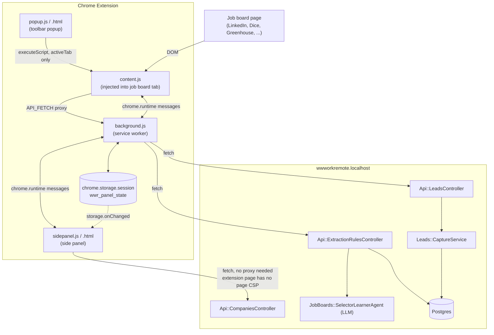
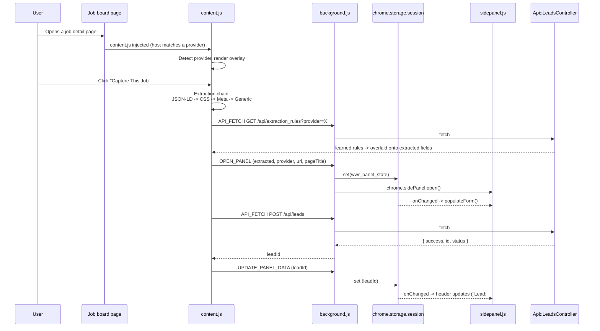
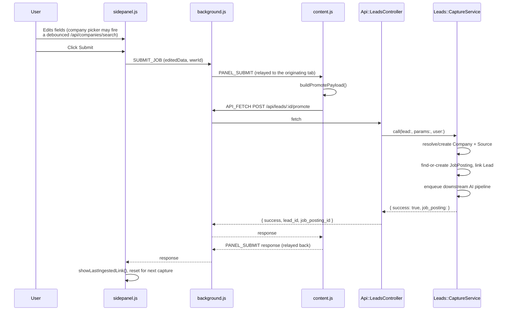
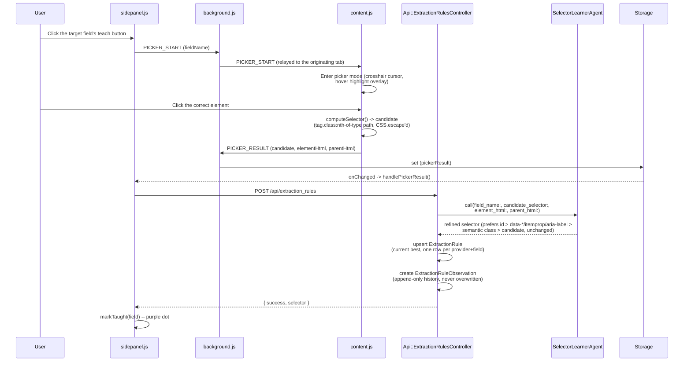
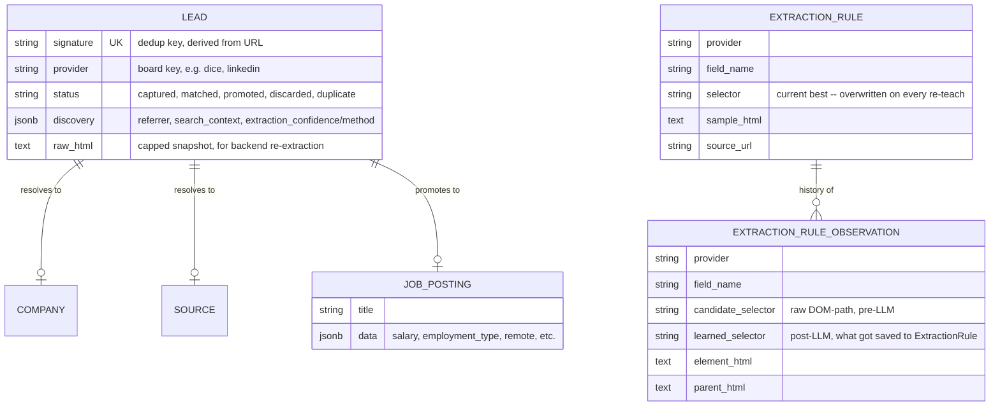

# Extension → wwworkremote.localhost: End-to-End Data Flow

How a job posting gets from a third-party job board, through the WWWorkRemote
Ingestion Assistant Chrome extension, into `wwworkremote.localhost` as a
`JobPosting` — every component, every hand-off, every contract.

## 1. Components

| Component | Runs in | Responsibility |
|---|---|---|
| `content.js` | The job board tab (isolated world) | Detects the provider, runs the extraction chain, renders the in-page overlay, captures the Lead, hosts element-picker ("teach") mode |
| `background.js` | Extension service worker | Relays messages between contexts, owns `chrome.storage.session` as shared state, proxies all API calls (page CSPs can block direct `fetch` from a content script; the service worker isn't subject to them) |
| `sidepanel.js` / `sidepanel.html` | Extension side panel (separate document) | The review/edit form, submit, diagnostics log, "teach" buttons |
| `popup.js` / `popup.html` | Extension toolbar popup | API endpoint/credentials config, manual "Scan This Page" trigger |
| `Api::LeadsController` | Rails | Captures a Lead; promotes a Lead into a `JobPosting` |
| `Api::ExtractionRulesController` | Rails | Serves learned selectors; teaches new ones via the LLM |
| `Api::CompaniesController` | Rails | Fuzzy company search for the panel's company picker |
| `JobBoards::SelectorLearnerAgent` | Rails (LLM call) | Turns a raw DOM-path candidate selector into a stable one |
| `Leads::CaptureService` | Rails | Promotes a Lead: resolves/creates Company + Source, builds the `JobPosting`, enqueues the normal downstream AI pipeline |

Nothing about the extension's promote path is a separate pipeline — a
promoted Lead resolves its `Source`/`Origin` the same way the scraper does
(`JobBoards::Syncer#resolve_dashboard_source`) and enqueues the same
downstream analysis jobs a scraped posting gets.

## 2. Architecture

Two deliberate design choices worth calling out:

- **All page-originated HTTP goes through `background.js`.** Content scripts
  run in the target page's own context, and some sites' CSP blocks a content
  script's own `fetch()` (observed on LinkedIn). The service worker isn't
  subject to any page's CSP, so `content.js` never calls `fetch` directly —
  it sends an `API_FETCH` message and lets `background.js` make the call.
- **`chrome.storage.session` is the state bus, not direct messaging.** The
  side panel has no `chrome.runtime.onMessage` listener — only a
  `chrome.storage.onChanged` listener. Anything that needs to reach the panel
  (extraction results, a picker result, a diagnostics log line) is written to
  storage; the panel reacts to the write, not to a message.

## 3. Sequence: Capture

Fires the instant `content.js` confirms a job-detail page — before the user
opens the panel.

`POST /api/leads` is idempotent on a signature derived from the URL
(`Lead.incoming_signature`) — revisiting the same page just refreshes
`found_at` on the existing Lead rather than creating a duplicate.

## 4. Sequence: Review & Submit (Promote)

`buildPromotePayload()` mirrors
`JobPostingEnrichment::AttributeBuilder::JSONB_KEYS` server-side, so the same
extracted fields land in `JobPosting#data` whether a posting arrived via the
extension or the scraper pipeline.

## 5. Sequence: Teach the Extractor

Per-provider, per-field. A LinkedIn selector taught here has no effect on
Indeed or Dice.

The next extraction on that provider (any future posting, any tab)
`GET`s `/api/extraction_rules?provider=X` and overlays every learned field
on top of the normal JSON-LD/CSS/meta/generic result — that's the
`applyLearnedRules()` step at the top of the capture sequence above.

## 6. Entities

`ExtractionRule` is a single current-value pointer per `(provider,
field_name)` — teaching a field again overwrites it. `ExtractionRuleObservation`
is the append-only log of every teach event for that pair, kept specifically
so repeated drift (the same field needing re-teaching over and over) is
visible as a pattern in the admin UI, not just felt as recurring annoyance.

## 7. Contracts

### `chrome.runtime` messages

| Type | Direction | Payload | Purpose |
|---|---|---|---|
| `OPEN_PANEL` | content.js → background | `{ mode, wwrId, leadId, extracted, provider, pageUrl, pageTitle }` | First call per capture; opens the side panel (must happen inside the click's user-gesture window) |
| `UPDATE_PANEL_DATA` | content.js → background | same shape as `OPEN_PANEL` | Patches storage once the panel is already open, without re-calling `sidePanel.open()` |
| `SUBMIT_JOB` | sidepanel.js → background → content.js (`PANEL_SUBMIT`) | `{ editedData, wwrId }` | User clicked Submit |
| `REEXTRACT` | sidepanel.js → background → content.js | `{ descOnly }` | "Re-read page" / "Re-read description" |
| `UPDATE_DESCRIPTION` | content.js → background → storage | `{ description_text, description_html }` | Desc-only patch after a re-read, doesn't clobber other edits |
| `API_FETCH` | content.js → background | `{ url, method, headers, body }` | CSP-bypassing fetch proxy |
| `PICKER_START` | sidepanel.js → background → content.js | `{ fieldName }` | Enter element-picker mode for one field |
| `PICKER_RESULT` | content.js → background → storage | `{ fieldName, value, elementHtml, parentHtml, candidateSelector }` or `{ fieldName, cancelled: true }` | Picker click result, arrives independently of `PICKER_START`'s own response |
| `DIAG_LOG` | content.js / sidepanel.js → background → storage | `{ level, text, ts, detail? }` | Capped (200-entry) diagnostics feed; `detail` carries structured data (raw JSON-LD, extraction metadata) for the panel's expandable log view |

### API endpoints

Machine-readable version: [`docs/architecture/openapi.yaml`](./architecture/openapi.yaml)
(the source of truth for exact request/response schemas — keep both in sync
when a payload shape changes).

| Endpoint | Request | Response |
|---|---|---|
| `POST /api/leads` | `{ url, provider, title, company_name, location, raw_html, discovery: {} }` | `{ success, id, status }` |
| `POST /api/leads/:id/promote` | `{ title, location, target_url, body, company_id? \| company: { name }, data: {} }` | `{ success, lead_id, job_posting_id }` |
| `POST /api/job_postings/:id/enrich` | `{ html, html_truncated, url, title, provider, extracted: {} }` | `{ success, message }` |
| `GET /api/extraction_rules?provider=` | — | `[{ field_name, selector }]` |
| `POST /api/extraction_rules` | `{ provider, field_name, candidate_selector, element_html, parent_html, source_url }` | `{ success, selector }` |
| `GET /api/companies/search?q=` | — | `[{ id, name, slug, status }]` |

## 8. Known fragility

- **Not every job board embeds `schema.org/JobPosting` JSON-LD everywhere.**
  Dice's dedicated `/job-detail/<id>` page does; its search split-view
  (`/jobs?...&selectedJobId=`) does not. The CSS tier's description selector
  for that view is a deep, position-dependent chain with no `id`/`data-*`
  hook available — expect it to break on Dice's next redesign, and re-teach
  via the picker rather than re-guessing the selector by hand.
- **A learned selector can be syntactically invalid.** The LLM can echo a
  class name containing a literal `.` (Tailwind decimal utilities like
  `gap-2.5`), which breaks unescaped in `querySelector`. Mitigated two ways:
  the agent's prompt now rules those out, and `applyLearnedRules()` wraps
  each rule's lookup individually so one bad selector can't block the rest.
- **The dev server is single-process, single-GVL Puma.** A slow synchronous
  call on one thread (e.g. `SelectorLearnerAgent`'s LLM round-trip) can
  visibly stall unrelated requests on every other thread. Not a connection
  pool or SolidQueue issue — SolidQueue runs as separate OS processes and
  doesn't compete for Puma's threads at all.
- **`mergeNonNull()` used to treat an empty string as a found value.**
  Workday's JSON-LD reliably reports `hiringOrganization.name: ""` on
  tenants that don't bother filling it in (confirmed live), and JSON-LD
  merges with higher priority than CSS — so that blank string silently
  clobbered the CSS tier's `companyFromWorkdayHostname()` fallback, shipping
  every such tenant's promote with no company. Fixed: `''` is now treated
  the same as `null`/`undefined` in the merge.
- **SmartRecruiters exposes structured salary via schema.org Microdata, not
  JSON-LD.** No `<script type="application/ld+json">` block exists on a
  SmartRecruiters posting, but a full `itemscope="JobPosting"` tree
  (`itemprop` attributes) is in the live DOM, including `baseSalary`. The
  old CSS selectors (`.summary-detail`) never worked — that markup only
  exists inside a `<script type="text/template">` print-summary widget,
  never real DOM (confirmed live: 0 matches on an NBCUniversal posting).
  Added `microdataJobPosting()` as a peer to the JSON-LD tier for this
  shape; SmartRecruiters now tries it first for title/company/location/
  employment_type/salary before falling back to CSS.
- **Salary disclosed only as prose is invisible to every current
  extraction tier.** Lever's `additional`/`additionalPlain` block (a
  separate field from `description`) and Workday's JSON-LD `description`
  itself sometimes state a rate or range in plain text — e.g. `"target
  hourly rate... $23 to $27"` — with no structured `baseSalary` anywhere on
  the page. None of JSON-LD/Microdata/CSS parse prose for a dollar figure,
  so `salary_min`/`salary_max` correctly come through empty on promote in
  this case; it's a real coverage gap, not a bug, and would need a
  regex/LLM pass over `description_text` to close.
- **A promoted `JobPosting`'s downstream categorization can silently erase
  data promote just wrote.** `JobBoards::Categorizer#apply_result` used to
  `.merge()` the LLM's parsed JSON directly into `JobPosting#data`,
  including `nil` for every "optional" key (`salary_min`, `salary_max`,
  `currency`, `is_remote`, `remote_nuance`) the LLM's response didn't
  mention — and `Hash#merge` lets a `nil` value overwrite a real one.
  Concretely: promote writes real `salary_min`/`salary_max` from a
  SmartRecruiters posting's structured data, `JobBoards::AnalysisJob` (which
  every `Leads::CaptureService.call` enqueues) runs `Categorizer` on it
  moments later, the categorization LLM doesn't independently re-derive
  salary from the body text, and the real values get wiped back to `nil`.
  Fixed by `.compact`-ing the LLM's optional fields before merging, so an
  absent key never overwrites a value that's already there.

## 9. Candidate provider research (TASK-37.4)

Live-checked 2026-08-18 against real postings (never reputation-only) for
the 6 candidates named in TASK-37.4 plus jobs.rubyonrails.org (added mid-
session). Recommendation for TASK-37.5, priority order:

1. **jobs.rubyonrails.org** — clean `JobPosting` JSON-LD, `title`/
   `hiringOrganization` match the page exactly, single-tenant (one Rails
   app, no per-company theme variance). 100% Rails/Ruby-relevant postings.
   Near-zero maintenance, highest role-family fit of any candidate here.
2. **Workable** (`apply.workable.com/{tenant}/j/{id}`) — clean JSON-LD
   confirmed on 2 real tenants (Rokt, GOVX), title/org match the page both
   times. Plenty of Staff/Senior Software Engineer postings observed.
3. **Himalayas** (`himalayas.app/companies/{slug}/jobs/{slug}`) — clean
   JSON-LD confirmed on 2 tenants (Linxon, lemon.io), matches the page both
   times. Role mix is broad (design/legal/marketing alongside engineering),
   so expect lower engineering-role yield per posting than Workable/Rails.
4. **iCIMS** (`careers-{tenant}.icims.com/jobs/{id}/{slug}/job`) — JSON-LD
   confirmed present and matching (Cotiviti tenant), and role mix skews
   senior/enterprise. **Implementation catch**: the entire posting — DOM
   and JSON-LD both — renders inside a same-origin `<iframe
   id="icims_content_iframe" src=".../job?in_iframe=1">`, not the top-level
   document. A content script matching only the top-level host won't see
   any of it; needs `all_frames: true` (manifest) plus walking into
   `iframe.contentDocument` the way this research did, or matching the
   iframe's own URL pattern directly. No other current provider has this
   shape — worth a deliberate design decision in TASK-37.5, not a
   copy-paste of the existing single-document extraction pattern. Plainly-
   named `iCIMS_*`/`icims_*` classes exist throughout as a CSS fallback if
   JSON-LD is ever thin on a given tenant.
5. **Work at a Startup** (`workatastartup.com/jobs/{id}`) — **no JSON-LD at
   all**, no `data-*` hooks; only generic Tailwind utility classes
   (`text-xl font-medium`, not hashed but not semantically stable either).
   The one usable structural hook: `<h1>Title at <a href="/companies/
   {slug}">Company</a></h1>` — same "title-suffix" shape as WeWorkRemotely/
   Greenhouse's logo-alt fallback, parseable but selector-fragile, would
   need `pickInnerText`-style prose parsing for salary/location/type
   (observed as plain sibling text, not discrete nodes). Role fit is
   excellent (Staff/Senior YC-backed roles, e.g. "$200K-$300K Staff Full
   Stack Engineer" observed) — worth the CSS maintenance cost specifically
   because of that fit, but budget it as a WeWorkRemotely-tier effort, not
   a JSON-LD tier one.
6. **BambooHR** (`{tenant}.bamboohr.com/careers/{id}`) — JSON-LD confirmed
   present and matching on 2 tenants (A-Line D.D.S., Practicing the Way).
   Technically viable, but **not recommended**: both live tenants found
   were a dental practice and a nonprofit — BambooHR's customer base skews
   small/mid-business across all industries, not tech employers. Observed
   postings were "Business Development Specialist" and "Interest Form", no
   engineering roles found in casual searching. Low expected yield against
   the `RoleFamily` taxonomy (staff+/senior IC, eng management) doesn't
   justify a new provider's maintenance surface. Skip unless a specific
   BambooHR-hosted tech employer is identified later.

**Drop from the candidate list: Otta.** `otta.com` now redirects to
`uk.welcometothejungle.com` — Otta Technology Ltd rebranded/consolidated
into Welcome to the Jungle (confirmed via the site's own footer). Otta as
originally named no longer exists as a distinct board to extract from. If
Welcome to the Jungle itself is worth evaluating, that's a fresh candidate
for a future spike, not implied by this research (not checked here — out
of TASK-37.4's named scope).
